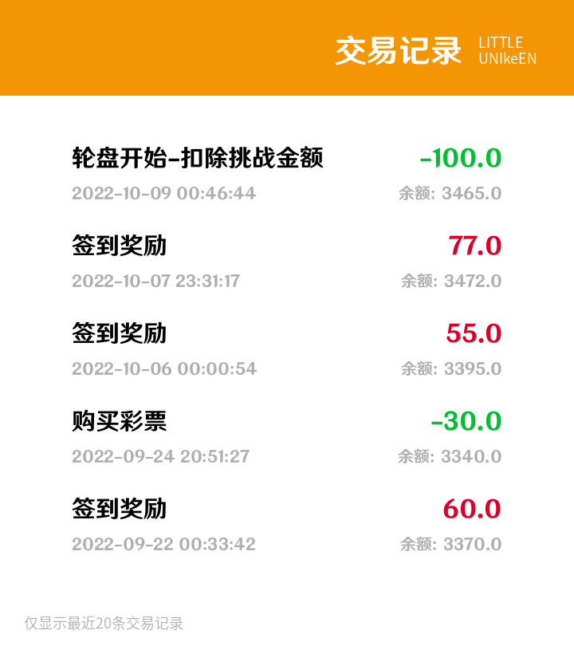

## 简介

由于 bot 的部分插件需要构建一套奖励机制，因此我们考虑引入金币系统，因此写了一整套 API 谨供插件程序员使用。

`1.0.0` 版本的金币系统有以下几个函数和功能：

| 函数名 | 功能 |
| ---- | ---- |
| create_account_sql | 创建金币系统的 sql  |
| get_user_coins | 查询用户金币 |
| update_user_coins | 更新用户金币 |
| get_user_transactions | 查询用户消费记录 |

详细使用方法可参考下面的代码：

## 代码分析

```python
from utils.basicEvent import warning
import mysql.connector
from datetime import datetime
from utils.basicConfigs import sqlConfig
from pymysql.converters import escape_string
from typing import Union
'''
BOT_DATA.accounts 账户
+----------+------------------+------+-----+---------+-------+
| Field    | Type             | Null | Key | Default | Extra |
+----------+------------------+------+-----+---------+-------+
| id       | bigint           | NO   | PRI | NULL    |       |
| coin     | bigint           | YES  |     | NULL    |       |
| lastSign | date             | YES  |     | NULL    |       |
| fortune  | tinyint unsigned | YES  |     | NULL    |       |
+----------+------------------+------+-----+---------+-------+

BOT_DATA.transactions 交易记录
+-------------+-----------------+------+-----+---------+----------------+
| Field       | Type            | Null | Key | Default | Extra          |
+-------------+-----------------+------+-----+---------+----------------+
| seq         | bigint unsigned | NO   | PRI | NULL    | auto_increment |
| timestp     | timestamp       | YES  |     | NULL    |                |
| qq          | bigint          | YES  |     | NULL    |                |
| changes     | bigint          | YES  |     | NULL    |                |
| balance     | bigint          | YES  |     | NULL    |                |
| description | varchar(255)    | YES  |     | NULL    |                |
+-------------+-----------------+------+-----+---------+----------------+
'''
def create_account_sql():
    """创建金币系统sql的函数"""
    try:
        mydb = mysql.connector.connect(**sqlConfig)
        mydb.autocommit = True
        mycursor = mydb.cursor()
        mycursor.execute("""
            create table if not exists `BOT_DATA`.`accounts` (
                `id` bigint not null,
                `coin` bigint,
                `lastSign` date,
                `fortune` tinyint unsigned,
                primary key (`id`)
            );
        """)
        mycursor.execute("""
            create table if not exists `BOT_DATA`.`transactions` (
                `seq` bigint unsigned not null auto_increment,
                `timestp` timestamp,
                `qq` bigint,
                `changes` bigint,
                `balance` bigint,
                `description` varchar(255),
                primary key (`seq`)
            );""")
    except mysql.connector.Error as e:
        warning("mysql error in create_account_sql: {}".format(e))
    except BaseException as e:
        warning("error in create_account_sql: {}".format(e))

def get_user_coins(id:int, format=True):
    """查询用户金币的函数
    @id:     用户QQ号
    @format: 是否对result/100处理 (默认为true, 表示输出为处理后值, 为小数且精确到分)

    @return:
        if format: 返回0.01整数倍的float, 单位是元
        else:      返回int, 单位是分
    """
    if isinstance(id, str):
        try:
            id = int(id)
        except BaseException as e:
            warning("meet exception in get_user_coins: id should be int, but got {}".format(id))
            return 
    try:
        mydb = mysql.connector.connect(**sqlConfig)
        mydb.autocommit = True
        mycursor = mydb.cursor()
        mycursor.execute("SELECT coin FROM `BOT_DATA`.`accounts` where id=%d"%id)
        result=list(mycursor)
        if len(result)==0:
            mycursor.execute(
                "INSERT INTO `BOT_DATA`.`accounts` (id, coin, lastSign) VALUES (%d, '0', '1980-01-01')"%id)
            return 0
        else:
            return int(result[0][0])/(100 if format else 1)
    except mysql.connector.Error as e:
        warning("mysql error in get_user_coins: {}".format(e))
    except BaseException as e:
        warning("error in get_user_coins: {}".format(e))
    return 0


def update_user_coins(id:int, append: Union[int, float], description:str, format:bool=True)->bool:
    """更新用户金币的函数
    @id: 用户号码, 必须为int
    @append: 
        增加金币数量
        if format: 单位是元
        else:      单位是分
    @format:
        是否对append x 100处理 (默认为True, 表示输入为原始金币值, 为小数且精确到分)
    @description:
        改变原因描述
    
    @return: 是否更改成功
    """
    if isinstance(id, str):
        try:
            id = int(id)
        except BaseException as e:
            warning("meet exception in update_user_coins: id should be int, but got {}".format(id))
            return False
    try:
        mydb = mysql.connector.connect(**sqlConfig)
        mydb.autocommit = True
        mycursor = mydb.cursor()
        mycursor.execute("SELECT coin FROM BOT_DATA.accounts where id=%d"%id)
    except mysql.connector.Error as e:
        warning("sql error in update_user_coins: {}".format(e))
        return False
    result=list(mycursor)
    num_append=int((append)*(100 if format else 1))
    if len(result)==0:
        try:
            mycursor.execute("""INSERT INTO BOT_DATA.accounts (id, coin, lastSign)
                VALUES (%d, %d, '1980-01-01');"""%(id, num_append))
            return True
        except mysql.connector.errors.DatabaseError as e:
            warning("sql error in update_user_coins: {}".format(e))
            return False
    else:
        try:
            result=int(result[0][0])
            mycursor.execute("""UPDATE BOT_DATA.accounts SET coin=%d
                 WHERE id=%d;"""%(result+num_append, id))
            now = datetime.now()
            now = now.strftime("%Y-%m-%d %H:%M:%S")
            mycursor.execute("""
                INSERT INTO BOT_DATA.transactions (timestp, qq, changes, balance, description)
                VALUES ('%s', %d, %d, %d, '%s');
                """%(escape_string(now), id, num_append, result+num_append, escape_string(description)))
            return True
        except mysql.connector.errors.DatabaseError as e:
            warning("sql error in update_user_coins: {}".format(e))
            return False # 更新失败

def get_user_transactions(id: int)->list:
    """查询用户消费记录函数
    @id: 用户QQ
    @return: 用户消费记录
    """
    if isinstance(id, str):
        try:
            id = int(id)
        except BaseException as e:
            warning("meet exception in get_user_transactions: id should be int, but got {}".format(id))
            return []
    try:
        mydb = mysql.connector.connect(**sqlConfig)
        mycursor = mydb.cursor()
        mycursor.execute("SELECT * FROM BOT_DATA.transactions where qq=%d ORDER BY `seq` desc limit 20;"%id)
        result=list(mycursor)
        return result
    except mysql.connector.Error as e:
        warning("sql error in get_user_transactions: {}".format(e))
        return []
```

## 应用场景

1. 轮盘赌

    

2. 消费记录查询

    