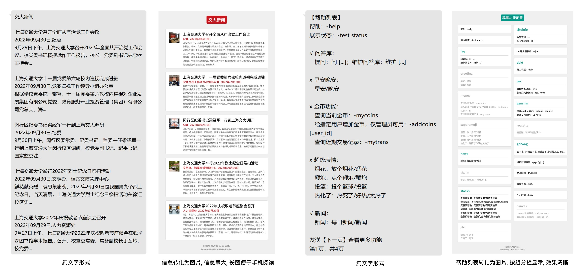
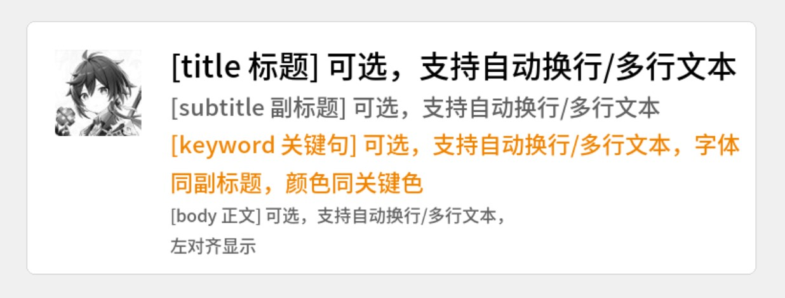
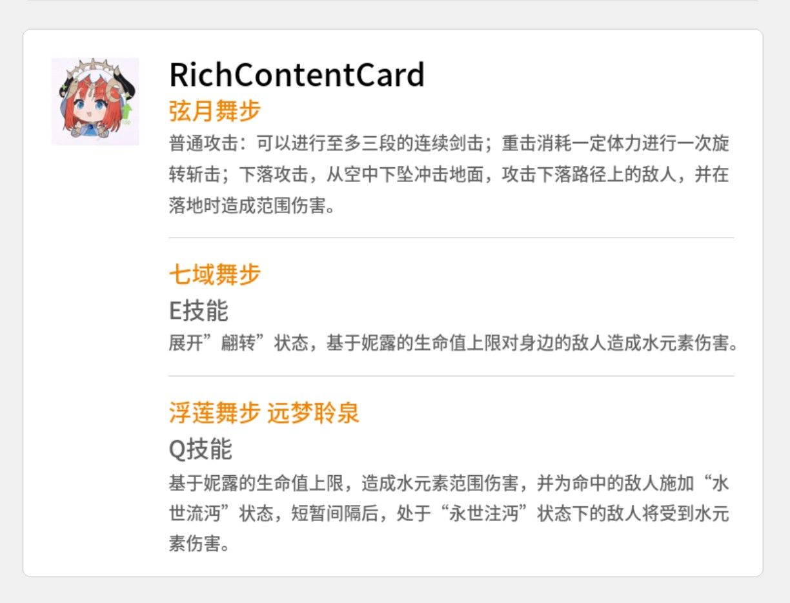

部分功能场景下，Bot的回答包含较多文字和插图（如"每日新闻"，"功能列表"），为避免发送大量文字的风控风险、美化回复信息的展示形式，可以将这些内容转化为一张图片发送。Little-UNIkeEN-Bot 基于 pillow 封装了 responseImage 库，方便开发者快速构建此类图片，以下是两个示例。

 

## 导入 responseImage 库

responseImage 库位于 `./utils/` 目录下。在插件代码中使用如下代码导入此库：

```python
from utils.responseImage import *
```

!!! tip "提示"
	在使用本库前，请确保 `./resources/fonts/` 目录下 `汉仪文黑.ttf` 和 `SourceHanSansCN-Medium.otf` 字体文件存放完整，否则您将无法使用默认字体。
    如要更换默认字体或字体存放地址，请修改库中全局常量代码。

## 创建图片

本库的所有操作均基于 ResponseImage 类完成，**新建一个 ResponseImage 类的实例以创建一张图片**。

示例代码：

```python
img = ResponseImage(
    theme = 'unicorn',
    title = '帮助列表', 
    titleColor = (165, 255, 255, 255), 
    primaryColor = PALETTE_SJTU_RED, 
    footer = '更新日期 2022/08/30',
    layout = 'two-column')
```

可选的参数如下：

<table>
     <tr>
          <th>属性名称</th>
          <th>描述</th>
          <th>取值</th>
          <th>取值说明</th>
          <th>备注</th>
	</tr>
     <tr>
          <td>theme</td>
          <td>主题</td>
          <td>unicorn</td>
          <td>表示使用默认主题</td>
          <td>可选，默认为'unicorn'</td>
     </tr>
     <tr>
          <td>autoSize</td>
          <td>自动调整大小</td>
          <td>bool型变量</td>
          <td>表示是否根据信息内容调整大小</td>
          <td>可选默认为True</td>
 </tr>
 <tr>
  <td rowspan=2>layout</td>
  <td rowspan=2>布局方式</td>
  <td>normal</td>
  <td>表示单栏布局</td>
  <td rowspan=2>可选，默认为单栏</td>
 </tr>
 <tr>
  <td>two-column</td>
  <td>表示双栏布局</td>
 </tr>
 <tr>
  <td>height</td>
  <td>图片高度</td>
  <td>int型变量</td>
  <td>表示图片高度</td>
  <td>可选，默认为800，autoSize为True时无效</td>
 </tr>
 <tr>
  <td>width</td>
  <td>图片宽度</td>
  <td>int型变量</td>
  <td>表示图片宽度</td>
  <td>可选，默认为880，autoSize为True时，将固定width自动调整高度</td>
 </tr>
 <tr>
  <td>title</td>
  <td>标题</td>
  <td>str型变量</td>
  <td>表示显示在图片顶部的标题</td>
  <td>可选，不支持换行，默认为'响应卡片'</td>
 </tr>
 <tr>
  <td>titleColor</td>
  <td>标题框颜色</td>
  <td >tuple型变量</td>
  <td>表示标题框颜色的RGBA值</td>
  <td>可选，若缺省，则与primaryColor一致</td>
 </tr>
 <tr>
  <td>primaryColor</td>
  <td>主题色</td>
  <td>tuple型变量</td>
  <td>表示主题色的RGBA值，将应用于前景卡片关键句颜色</td>
  <td>可选，默认为蓝色</td>
 </tr>
 <tr>
  <td>backColor</td>
  <td>背景色</td>
  <td>tuple型变量</td>
  <td>表示图片背景颜色的RGBA值</td>
  <td>可选，默认为(240,240,240,255)</td>
 </tr>
 <tr>
  <td>footer</td>
  <td>页脚</td>
  <td>str型变量</td>
  <td>表示显示在图片底部的页脚</td>
  <td >可选，不支持换行，默认为空</td>
 </tr>
 <tr>
  <td>cardTitleFont</td>
  <td>前景卡片标题字体</td>
  <td>ImageFont.FreeTypeFont型变量</td>
  <td>表示前景卡片标题使用的字体及大小</td>
  <td>可选</td>
 </tr>
 <tr>
  <td>cardSubtitleFont</td>
  <td>前景卡片副标题字体</td>
  <td>ImageFont.FreeTypeFont型变量</td>
  <td>表示前景卡片副标题和关键句使用的字体及大小</td>
  <td>可选</td>
 </tr>
 <tr>
  <td>cardBodyFont</td>
  <td>前景卡片正文字体</td>
  <td>ImageFont.FreeTypeFont型变量</td>
  <td>表示前景卡片正文使用的字体及大小</td>
  <td>可选</td>
 </tr>
</table>


##  添加前景卡片

ResponseImage 实例相当于一个容器。如要让图片展示各类信息，你需要向实例添加一个或多个"前景卡片"。

"前景卡片"机制可以帮助你将各类信息分组展示。

### addCard() 添加卡片

使用 `ResponseImage.addCard()` 函数，向 ResponseImage 实例添加单个前景卡片。卡片在图片中按添加卡片的顺序显示。

示例代码：

```python
img.addCard(
    ResponseImage.NormalCard(
        title ='原神2.1版本',
        subtitle = '「韶光抚月，天下人间」PV台词',
        body = """风雨犹祝，山海同欢，是承天地之佑；
星移斗转，沧海桑田，烟火人间依旧；
功名在我，百岁千秋，毋忘秉烛夜游；
古今诸事，激荡中流，宏图待看新秀。""",
        icon = 'data:image/png;base64,iVBORw0KGgoAAAANSUhEUgAAAEAAAABACAMAAACdt4HsAA...',
        subtitleFontColor=PALETTE_GREEN,
        backColor=PALETTE_LIGHTGREEN
    )
)
```

库预设了多种卡片类型可供添加：


#### NormalCard

标准类型前景卡片，内容左对齐。

可供编辑的参数如下：

<table>
     <tr>
          <th>属性名称</th>
          <th>描述</th>
          <th>取值</th>
          <th>取值说明</th>
          <th>备注</th>
	</tr>
     <tr>
          <td>title</td>
          <td>标题</td>
          <td>str型变量</td>
          <td>表示前景卡片显示的标题</td>
          <td>可选</td>
     </tr>
     <tr>
          <td>subtitle</td>
          <td>副标题</td>
          <td>str型变量</td>
          <td>表示前景卡片显示的副标题</td>
          <td>可选</td>
     </tr>
    <tr>
          <td>keyword</td>
          <td>关键句</td>
          <td>str型变量</td>
          <td>表示前景卡片显示的关键句</td>
          <td>可选，关键句字体同副标题，颜色同图片主题色</td>
     </tr>
    <tr>
          <td>body</td>
          <td>正文</td>
          <td>str型变量</td>
          <td>表示前景卡片显示的正文</td>
          <td>可选</td>
     </tr>
    <tr>
          <td>icon</td>
          <td>图标</td>
          <td>str型变量或Image对象</td>
          <td>表示前景卡片靠左显示的图标</td>
          <td>可选，支持本地图片/网络图片地址，base64编码串或PIL.Image对象。将自动缩放为90x90大小显示</td>
     </tr>
    <tr>
          <td>titleFontColor</td>
          <td>标题字体颜色</td>
          <td>tuple型变量</td>
          <td>表示前景卡片标题字体颜色的RGBA值</td>
          <td>可选，默认为黑色</td>
     </tr>
    <tr>
          <td>subtitleFontColor</td>
          <td>副标题字体颜色</td>
          <td>tuple型变量</td>
          <td>表示前景卡片副标题字体颜色的RGBA值</td>
          <td>可选，默认为深灰</td>
     </tr>
    <tr>
          <td>bodyFontColor</td>
          <td>正文字体颜色</td>
          <td>tuple型变量</td>
          <td>表示前景卡片正文部分字体颜色的RGBA值</td>
          <td>可选，默认为浅灰</td>
     </tr>
    <tr>
          <td>backColor</td>
          <td>卡片背景颜色</td>
          <td>tuple型变量</td>
          <td>表示前景卡片背景颜色的RGBA值</td>
          <td>可选，默认为白色</td>
     </tr>
</table>

!!! tip "提示：空行"
      在同一项中试图添加空行时，请尽量确保空行至少含有一个空格

示例代码及效果：

```python
img.addCard(
    ResponseImage.NormalCard(
        title ='[title 标题] 可选，支持自动换行/多行文本',
        subtitle = '[subtitle 副标题] 可选，支持自动换行/多行文本',
        keyword = '[keyword 关键句] 可选，支持自动换行/多行文本，字体同副标题，颜色同关键色',
        body = '[body 正文] 可选，支持自动换行/多行文本，\n左对齐显示',
        icon = '...',
    )
)
```

 


#### NoticeCard

通知类型前景卡片，内容居中显示。

可供编辑的参数如下：

<table>
     <tr>
          <th>属性名称</th>
          <th>描述</th>
          <th>取值</th>
          <th>取值说明</th>
          <th>备注</th>
	</tr>
     <tr>
          <td>title</td>
          <td>标题</td>
          <td>str型变量</td>
          <td>表示前景卡片显示的标题</td>
          <td>可选</td>
     </tr>
     <tr>
          <td>subtitle</td>
          <td>副标题</td>
          <td>str型变量</td>
          <td>表示前景卡片显示的副标题</td>
          <td>可选</td>
     </tr>
    <tr>
          <td>keyword</td>
          <td>关键句</td>
          <td>str型变量</td>
          <td>表示前景卡片显示的关键句</td>
          <td>可选，关键句字体同副标题，颜色同图片主题色</td>
     </tr>
    <tr>
          <td>body</td>
          <td>正文</td>
          <td>str型变量</td>
          <td>表示前景卡片显示的正文</td>
          <td>可选</td>
     </tr>
    <tr>
          <td>illustration</td>
          <td>配图</td>
          <td>str型变量或Image对象</td>
          <td>表示前景卡片底部显示的配图</td>
          <td>可选，支持本地图片/网络图片地址，base64编码串或PIL.Image对象。若图片过大，将自动缩放以适配卡片宽度</td>
     </tr>
    <tr>
          <td>titleFontColor</td>
          <td>标题字体颜色</td>
          <td>tuple型变量</td>
          <td>表示前景卡片标题字体颜色的RGBA值</td>
          <td>可选，默认为黑色</td>
     </tr>
    <tr>
          <td>subtitleFontColor</td>
          <td>副标题字体颜色</td>
          <td>tuple型变量</td>
          <td>表示前景卡片副标题字体颜色的RGBA值</td>
          <td>可选，默认为深灰</td>
     </tr>
    <tr>
          <td>bodyFontColor</td>
          <td>正文字体颜色</td>
          <td>tuple型变量</td>
          <td>表示前景卡片正文部分字体颜色的RGBA值</td>
          <td>可选，默认为浅灰</td>
     </tr>
    <tr>
          <td>backColor</td>
          <td>卡片背景颜色</td>
          <td>tuple型变量</td>
          <td>表示前景卡片背景颜色的RGBA值</td>
          <td>可选，默认为白色</td>
     </tr>
</table>

示例代码及效果：

```python
img.addCard(
    ResponseImage.NoticeCard(
        title ='NoticeCard\n[title 标题] 可选，支持自动换行/多行文本',
        subtitle = '[subtitle 副标题] 可选，支持自动换行/多行文本',
        keyword = '[keyword 关键句] 可选，支持自动换行/多行文本，字体同副标题，颜色同关键色',
        body = '[body 正文] 可选，支持自动换行/多行文本，\n居中显示',
        icon = 'https://picx.zhimg.com/v2-7d1069f8beeeae09f0d26812941cebe0_1440w.jpg?source=172ae18b',
    )
)
```

 


#### RichContentCard

富内容复合类型卡片，可以在一个前景卡片中显示复合格式的多行文本。

<table>
     <tr>
          <th>属性名称</th>
          <th>描述</th>
          <th>取值</th>
          <th>取值说明</th>
          <th>备注</th>
	</tr>
     <tr>
          <td>raw_content</td>
          <td>内容</td>
          <td>list型变量</td>
          <td>表示前景卡片显示的内容</td>
          <td>可选，以列表嵌套元组形式输入，元组示例：（格式，内容）</td>
     </tr>
    <tr>
          <td>icon</td>
          <td>图标</td>
          <td>str型变量或Image对象</td>
          <td>表示前景卡片靠左显示的图标</td>
          <td>可选，支持本地图片/网络图片地址，base64编码串或PIL.Image对象。将自动缩放为90x90大小显示</td>
     </tr>
    <tr>
          <td>titleFontColor</td>
          <td>标题字体颜色</td>
          <td>tuple型变量</td>
          <td>表示前景卡片标题字体颜色的RGBA值</td>
          <td>可选，默认为黑色</td>
     </tr>
    <tr>
          <td>subtitleFontColor</td>
          <td>副标题字体颜色</td>
          <td>tuple型变量</td>
          <td>表示前景卡片副标题字体颜色的RGBA值</td>
          <td>可选，默认为深灰</td>
     </tr>
    <tr>
          <td>bodyFontColor</td>
          <td>正文字体颜色</td>
          <td>tuple型变量</td>
          <td>表示前景卡片正文部分字体颜色的RGBA值</td>
          <td>可选，默认为浅灰</td>
     </tr>
    <tr>
          <td>backColor</td>
          <td>卡片背景颜色</td>
          <td>tuple型变量</td>
          <td>表示前景卡片背景颜色的RGBA值</td>
          <td>可选，默认为白色</td>
     </tr>
</table>

内容以列表的形式输入'raw_content'参数，列表中每项为一个形如 `(类型，内容)` 的元组，其中可选项如下。

<table>
      <tr>
          <th>类型名称</th>
          <th>描述</th>
          <th>内容类型</th>
          <th>备注</th>
	</tr>
      <tr>
          <td>title</td>
          <td>标题</td>
          <td>str型变量</td>
          <td></td>
	</tr>
      <tr>
          <td>keyword</td>
          <td>关键句</td>
          <td>str型变量</td>
          <td></td>
	</tr>
      <tr>
          <td>subtitle</td>
          <td>副标题</td>
          <td>str型变量</td>
          <td></td>
	</tr>
      <tr>
          <td>body</td>
          <td>正文</td>
          <td>str型变量</td>
          <td></td>
	</tr>
      <tr>
          <td>separator</td>
          <td>分割线</td>
          <td></td>
          <td>分割线类型无需提供内容项</td>
	</tr>
      <tr>
          <td>progressBar</td>
          <td>进度条</td>
          <td>float型变量(0-1)</td>
          <td>内容项第一项即进度条进度，如在进度项后加'auto'项，则会自动根据进度更改颜色；如在进度项后加两项颜色变量，则可分别指定进度条前景色和背景色</td>
	</tr>
</table>

示例代码及效果：

```python
img.addCard(
    ResponseImage.RichContentCard(
        raw_content=[
            ('title', 'RichContentCard'),
            ('keyword', '弦月舞步'),
            ('body', '普通攻击：可以进行至多三段的连续剑击；重击消耗一定体力进行一次旋转斩击；下落攻击，从空中下坠冲击地面，攻击下落路径上的敌人，并在落地时造成范围伤害。'),
            ('separator',),
            ('keyword', '七域舞步'),
            ('subtitle', 'E技能'),
            ('body', '展开”翩转”状态，基于妮露的生命值上限对身边的敌人造成水元素伤害。'),
            ('separator',),
            ('keyword', '浮莲舞步 远梦聆泉'),
            ('subtitle', 'Q技能'),
            ('body', '基于妮露的生命值上限，造成水元素范围伤害，并为命中的敌人施加“水世流沔”状态，短暂间隔后，处于“永世注沔”状态下的敌人将受到水元素伤害。'),
        ],
        icon = 'https://gimg2.baidu.com/image_search/src=http%3A%2F%2Fimgo.hackhome.com%2Fimg2022%2F7%2F5%2F11%2F23040603.jpg&refer=http%3A%2F%2Fimgo.hackhome.com&app=2002&size=f9999,10000&q=a80&n=0&g=0n&fmt=auto?sec=1667132746&t=a133591be6a3a16de33e20c8989f424c'
    )
)
```

 


#### BlankCard

空白卡片，参数如下：

<table>
     <tr>
          <th>属性名称</th>
          <th>描述</th>
          <th>取值</th>
          <th>取值说明</th>
          <th>备注</th>
	</tr>
     <tr>
          <td>size</td>
          <td>高度</td>
          <td>int型变量</td>
          <td>表示前景卡片的高度 (不含边框和间距)</td>
          <td>可选，默认为0</td>
     </tr>
    <tr>
          <td>backColor</td>
          <td>卡片背景颜色</td>
          <td>tuple型变量</td>
          <td>表示前景卡片背景颜色的RGBA值</td>
          <td>可选，默认为白色</td>
     </tr>
</table>


### addCardList() 添加卡片列表

使用 `ResponseImage.addCardList()` 函数，可以以列表形式一次添加多个前景卡片，卡片类型同上。

### 使用字典类型添加卡片

除使用形如 `NormalCard` 等类外，你也可以使用字典形式添加卡片数据，字典的 style 键值必选，表示卡片类型。以下两段代码的效果相同：

```python
img.addCard(
    ResponseImage.NormalCard(
        title ='[title 标题] 可选，支持自动换行/多行文本',
        subtitle = '[subtitle 副标题] 可选，支持自动换行/多行文本',
        keyword = '[keyword 关键句] 可选，支持自动换行/多行文本，字体同副标题，颜色同关键色',
        body = '[body 正文] 可选，支持自动换行/多行文本，\n左对齐显示',
        icon = '...',
    )
)
```

```python hl_lines="3"
img.addCard(
    {
        'style':'normal',
        'title': '[title 标题] 可选，支持自动换行/多行文本',
        'subtitle': '[subtitle 副标题] 可选，支持自动换行/多行文本',
        'keyword': '[keyword 关键句] 可选，支持自动换行/多行文本，字体同副标题，颜色同关键色',
        'body': '''[body 正文] 可选，支持自动换行/多行文本，
左对齐显示''',
        'icon': '...'
    }
)
```

!!! warning "注意"
    使用字典类型作为参数添加卡片，好处是方便修改卡片类型，缺点是没有代码提示、容易打错字段名称，所以，请小心检查字典中的键！

## generateImage() 生成并保存

使用 `ResponseImage.generateImage(savePath)` 函数生成图片并保存图片到硬盘。

函数返回值是一个 PIL.Image 对象，你可以对此对象使用 pillow 库继续编辑。

函数参数如下：

<table>
    <tr>
          <th>参数名称</th>
          <th>描述</th>
          <th>取值</th>
          <th>取值说明</th>
          <th>备注</th>
	</tr>
    <tr>
          <td>savePath</td>
          <td>保存地址</td>
          <td>str型变量</td>
          <td>表示图片的保存地址</td>
          <td>可选，默认为空 (不保存)</td>
    </tr>
</table>

## getBlankCoord() 获取空白卡片坐标

使用 `ResponseImage.getBlankCoord()` 获得 BlankCard 类型卡片的位置。

函数返回值是一个列表，列表每项是一 BlankCard 类型卡片四角的坐标。使用此坐标，你可以在添加的空白卡片处绘制。

## 常量列表

库中预设了一些颜色常量，方便开发者统一颜色

### 标准颜色常量

<table>
    <tr>
          <th>常量名称</th>
          <th>描述</th>
          <th>取值</th>
          <th>示例</th>
	</tr>
    <tr>
          <td>PALETTE_BLACK</td>
          <td>黑色</td>
          <td>(0, 0, 0, 255)</td>
          <td style="color:#000000">示例文字</td>
    </tr>
    <tr>
          <td>PALETTE_WHITE</td>
          <td>白色</td>
          <td>(255, 255, 255, 255)</td>
          <td style="color:#FFFFFF">示例文字</td>
    </tr>
    <tr>
          <td>PALETTE_GERY</td>
          <td>灰色</td>
          <td>(158, 158, 158, 255)</td>
          <td style="color:#9E9E9E">示例文字</td>
    </tr>
    <tr>
          <td>PALETTE_GREY_SUBTITLE</td>
          <td>灰色(副标题)</td>
          <td>(95, 95, 95, 255)</td>
          <td style="color:#5F5F5F">示例文字</td>
    </tr>
    <tr>
          <td>PALETTE_GREY_CONTENT</td>
          <td>灰色(正文)</td>
          <td>(125, 125, 125, 255)</td>
          <td style="color:#7D7D7D">示例文字</td>
    </tr>
    <tr>
          <td>PALETTE_GERY_BORDER</td>
          <td>灰色(边框)</td>
          <td>(213, 213, 213, 255)</td>
          <td style="color:#D5D5D5">示例文字</td>
    </tr>
    <tr>
          <td>PALETTE_GERY_BACK</td>
          <td>灰色(背景)</td>
          <td>(240, 240, 240, 255)</td>
          <td style="color:#F0F0F0">示例文字</td>
    </tr>
    <tr>
          <td>PALETTE_RED</td>
          <td>红色</td>
          <td>(221, 0, 38, 255)</td>
          <td style="color:#DD0026">示例文字</td>
    </tr>
    <tr>
          <td>PALETTE_LIGHTRED</td>
          <td>浅红色</td>
          <td>(255, 232, 236, 255)</td>
          <td style="color:#FFE8EC">示例文字</td>
    </tr>
    <tr>
          <td>PALETTE_GREEN</td>
          <td>绿色</td>
          <td>(0, 191, 48, 255)</td>
          <td style="color:#00BF30">示例文字</td>
    </tr>
    <tr>
          <td>PALETTE_LIGHTGREEN</td>
          <td>浅绿色</td>
          <td>(219, 255, 228, 255)</td>
          <td style="color:#DBFFE4">示例文字</td>
    </tr>
    <tr>
          <td>PALETTE_ORANGE</td>
          <td>橙色</td>
          <td>(244, 149, 4, 255)</td>
          <td style="color:#F49504">示例文字</td>
    </tr>
    <tr>
          <td>PALETTE_LIGHTORANGE</td>
          <td>浅橙色</td>
          <td>(254, 232, 199, 255)</td>
          <td style="color:#FEE8C7">示例文字</td>
    </tr>
    <tr>
          <td>PALETTE_BLUE</td>
          <td>蓝色</td>
          <td>(32, 131, 197, 255)</td>
          <td style="color:#2083C5">示例文字</td>
    </tr>
    <tr>
          <td>PALETTE_LIGHTBLUE</td>
          <td>浅蓝色</td>
          <td>(9, 188, 211, 255)</td>
          <td style="color:#09BCD3">示例文字</td>
    </tr>
    <tr>
          <td>PALETTE_CYAN</td>
          <td>青色</td>
          <td>(0, 150, 136, 255)</td>
          <td style="color:#009688">示例文字</td>
    </tr>
    <tr>
          <td>PALETTE_INDIGO</td>
          <td>靛蓝色</td>
          <td>(69, 84, 164, 255)</td>
          <td style="color:#4554A4">示例文字</td>
    </tr>
</table>

### SJTU 视觉标准色常量

以下颜色满足上海交通大学视觉识别系统的颜色标准

<table>
    <tr>
          <th>常量名称</th>
          <th>描述</th>
          <th>取值</th>
          <th>示例</th>
	</tr>
    <tr>
          <td>PALETTE_SJTU_RED</td>
          <td>交大红</td>
          <td>(200, 22, 30, 255)</td>
          <td style="color:#C8161E">示例文字</td>
    </tr>
    <tr>
          <td>PALETTE_SJTU_DARKRED</td>
          <td>交大暗红</td>
          <td>(167, 32, 56, 255)</td>
          <td style="color:#A72038">示例文字</td>
    </tr>
    <tr>
          <td>PALETTE_SJTU_ORANGE</td>
          <td>交大橙</td>
          <td>(240, 131, 0, 255)</td>
          <td style="color:#F08300">示例文字</td>
    </tr>
    <tr>
          <td>PALETTE_SJTU_YELLOW</td>
          <td>交大黄</td>
          <td>(253, 208, 0, 255)</td>
          <td style="color:#FDD000">示例文字</td>
    </tr>
    <tr>
          <td>PALETTE_SJTU_BLUE</td>
          <td>交大蓝</td>
          <td>(0, 134, 209, 255)</td>
          <td style="color:#0086D1">示例文字</td>
    </tr>
    <tr>
          <td>PALETTE_SJTU_DARKBLUE</td>
          <td>交大暗蓝</td>
          <td>(0, 64, 152, 255)</td>
          <td style="color:#004098">示例文字</td>
    </tr>
    <tr>
          <td>PALETTE_SJTU_GREEN</td>
          <td>交大绿</td>
          <td>(51, 141, 39, 255)</td>
          <td style="color:#338D27">示例文字</td>
    </tr>
    <tr>
          <td>PALETTE_SJTU_CYAN</td>
          <td>交大青</td>
          <td>(0, 81, 78, 255)</td>
          <td style="color:#00514E">示例文字</td>
    </tr>
</table>