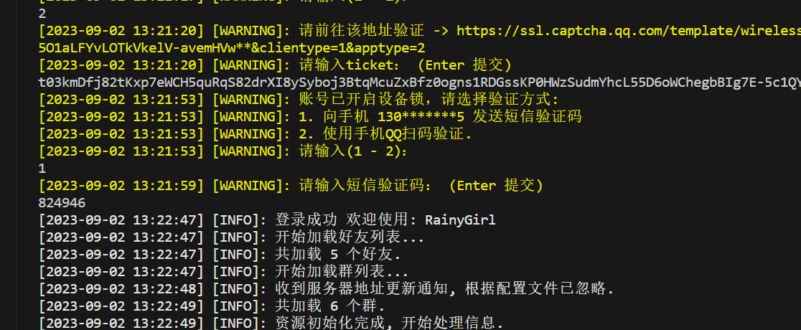
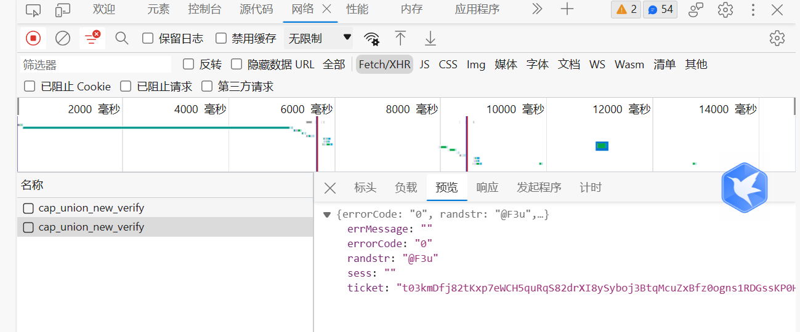

# 配置 go-cqhttp

Little-UNIkeEN-Bot 是 QQ 机器人前端，只能处理交互逻辑，不能直接实现 QQ 机器人的所有功能。我们需要额外安装驱动器来实现与QQ服务器的信息收发与交互。

## 1. 安装 go-cqhttp

本 Bot 默认使用 go-cqhttp 作为驱动器，这是一个优秀的无头 QQ 客户端，关于其安装请见 [go-cqhttp官网 - 安装](https://docs.go-cqhttp.org/guide/quick_start.html#%E5%9F%BA%E7%A1%80%E6%95%99%E7%A8%8B) 。

## 2. 配置 go-cqhttp

安装完成后，第一次打开 go-cqhttp 时请选择“HTTP通信”，然后修改生成的 `config.yml` 文件如下：

```yaml hl_lines="96 108"
# go-cqhttp 默认配置文件

account: # 账号相关
  uin: {需要修改的地方1} # QQ账号
  password:  {需要修改的地方2} # 密码为空时使用扫码登录
  encrypt: false  # 是否开启密码加密
  status: 0      # 在线状态 请参考 https://docs.go-cqhttp.org/guide/config.html#在线状态
  relogin: # 重连设置
    delay: 3   # 首次重连延迟, 单位秒
    interval: 3   # 重连间隔
    max-times: 0  # 最大重连次数, 0为无限制

  # 是否使用服务器下发的新地址进行重连
  # 注意, 此设置可能导致在海外服务器上连接情况更差
  use-sso-address: false
  # 是否允许发送临时会话消息
  allow-temp-session: true
  sign-server:  {需要修改的地方3} # 签名服务器，推荐 'https://qsign.loli.vet/'
heartbeat:
  # 心跳频率, 单位秒
  # -1 为关闭心跳
  interval: 5

message:
  # 上报数据类型
  # 可选: string,array
  post-format: string
  # 是否忽略无效的CQ码, 如果为假将原样发送
  ignore-invalid-cqcode: false
  # 是否强制分片发送消息
  # 分片发送将会带来更快的速度
  # 但是兼容性会有些问题
  force-fragment: false
  # 是否将url分片发送
  fix-url: false
  # 下载图片等请求网络代理
  proxy-rewrite: ''
  # 是否上报自身消息
  report-self-message: false
  # 移除服务端的Reply附带的At
  remove-reply-at: false
  # 为Reply附加更多信息
  extra-reply-data: false
  # 跳过 Mime 扫描, 忽略错误数据
  skip-mime-scan: false

output:
  # 日志等级 trace,debug,info,warn,error
  log-level: warn
  # 日志时效 单位天. 超过这个时间之前的日志将会被自动删除. 设置为 0 表示永久保留.
  log-aging: 15
  # 是否在每次启动时强制创建全新的文件储存日志. 为 false 的情况下将会在上次启动时创建的日志文件续写
  log-force-new: true
  # 是否启用日志颜色
  log-colorful: true
  # 是否启用 DEBUG
  debug: false # 开启调试模式

# 默认中间件锚点
default-middlewares: &default
  # 访问密钥, 强烈推荐在公网的服务器设置
  access-token: ''
  # 事件过滤器文件目录
  filter: ''
  # API限速设置
  # 该设置为全局生效
  # 原 cqhttp 虽然启用了 rate_limit 后缀, 但是基本没插件适配
  # 目前该限速设置为令牌桶算法, 请参考:
  # https://baike.baidu.com/item/%E4%BB%A4%E7%89%8C%E6%A1%B6%E7%AE%97%E6%B3%95/6597000?fr=aladdin
  rate-limit:
    enabled: false # 是否启用限速
    frequency: 1  # 令牌回复频率, 单位秒
    bucket: 1     # 令牌桶大小

database: # 数据库相关设置
  leveldb:
    # 是否启用内置leveldb数据库
    # 启用将会增加10-20MB的内存占用和一定的磁盘空间
    # 关闭将无法使用 撤回 回复 get_msg 等上下文相关功能
    enable: true

  # 媒体文件缓存， 删除此项则使用缓存文件(旧版行为)
  cache:
    image: data/image.db
    video: data/video.db

# 连接服务列表
servers:
  # 添加方式，同一连接方式可添加多个，具体配置说明请查看文档
  #- http: # http 通信
  #- ws:   # 正向 Websocket
  #- ws-reverse: # 反向 Websocket
  #- pprof: #性能分析服务器

  - http: # HTTP 通信设置
      address: 127.0.0.1:5700 # HTTP监听地址
      timeout: 5      # 反向 HTTP 超时时间, 单位秒，<5 时将被忽略
      long-polling:   # 长轮询拓展
        enabled: false       # 是否开启
        max-queue-size: 2000 # 消息队列大小，0 表示不限制队列大小，谨慎使用
      middlewares:
        <<: *default # 引用默认中间件
      post:           # 反向HTTP POST地址列表
      #- url: ''                # 地址
      #  secret: ''             # 密钥
      #  max-retries: 3         # 最大重试，0 时禁用
      #  retries-interval: 1500 # 重试时间，单位毫秒，0 时立即
      - url: http://127.0.0.1:5701/ # 地址
        secret: ''                  # 密钥
        max-retries: 0            # 最大重试，0 时禁用
        retries-interval: 3000      # 重试时间，单位毫秒，0 时立即

```

请记住两处高亮处您设置的端口号，在"部署 Bot"一节，我们将再次用到。

配置文件中的其余部分（如账号登陆状态，消息发送重试次数等），你均可以参考注释，按需更改。

## 3. 启动 go-cqhttp

完成上述配置后，您可以启动 go-cqhttp。

Windows 环境下直接运行 go-cqhttp.bat

Linux 环境下，在 go-cqhttp 目录下输入以下命令以运行

```bash
./go-cqhttp # 老版本gocqhttp是可执行文件
go-cqhttp   # v1.1.0版本gocqhttp是dpkg包，会安装到bin文件夹下
```

!!! tip "提示：后台运行与多终端管理"
    Linux环境下，推荐使用 tmux 管理终端，并在 tmux 中新建一个 session 以后台运行 go-cqhttp

## 4. 登录问题

在使用 go-cqhttp 登录你的 Bot 账号时，可能会遇到安全验证。在安全验证之前，首先把 `device.json` 的 `"protocol"` 值改成5，参考[设备型号](https://docs.go-cqhttp.org/guide/config.html#%E8%AE%BE%E5%A4%87%E4%BF%A1%E6%81%AF)。



当出现以上选项时，请输入2，将出现的链接复制进浏览器，按F12进入开发者选项。输入captcha以后，开发者窗口会有如下显示：



看到“预览”-“ticket”选项，右键ticket，选择“复制值”，然后将复制的东西粘贴到go-cqhttp里。


## 5. 注意

1. 如你在服务器运行，由于扫码手机与服务器端通常不在同一网络环境下，你可能会遇到扫码失败的情况。此时，你可以在本机使用 go-cqhttp 扫码登录，并将产生的 `device.json` 和 `session.token` 文件复制到服务器的 go-cqhttp 目录下，然后重新启动 go-cqhttp。
2. 如果gocqhttp提示当前QQ版本过低，请换个号重试