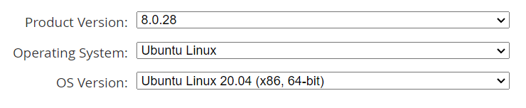

# 配置SQL

Little-UNIkeEN-Bot 关于用户数据、功能配置等数据存储均是基于 MySQL 实现的。在运行 Bot 之前，你需要为服务器安装 MySQL 环境。

关于 MySQL 的安装，可以参见如下教程 [eg1](https://cloud.tencent.com/developer/article/1863236) ，[eg2](https://www.runoob.com/mysql/mysql-install.html)。

具体来说，首先到 [MySQL官网](https://downloads.mysql.com/archives/community/) 下载对应操作系统的包，搜索条件如下（ProductVersion 选择最新，OsVersion 选择相应系统版本）：



复制下载链接并在终端输入以下命令：

```bash
# stage 1: download
cd ~/tmp
wget ${YOUR_COPIED_URL}
sudo dpkg -i ${DOWNLOADED_DEB}
sudo apt update
sudo apt install mysql-server

# stage 2: init
sudo chown -R mysql:mysql /var/lib/mysql/
mysqld --initialize
systemctl start mysqld
```

完成安装后，修改配置和密码，此处不再赘述，你可以参考上述网站教程。

直到你输入以下命令后可以显示 MySQL 命令行，你的 MySQL 安装过程就算大功告成了：

```bash
mysql -u root -p
```

!!! tip "提示：可视化"
    如果你是在本机安装SQL的话，推荐 MySQL Workbench 作为 MySQL 可视化工具。

!!! warning "注意：旧的数据存储格式"
    一些内测时期的旧版功能插件可能使用 JSON 文件存储用户数据，你可以自行选择修改为 SQL 存储。出于性能与统一化考量，我们推荐您使用 SQL 存储。