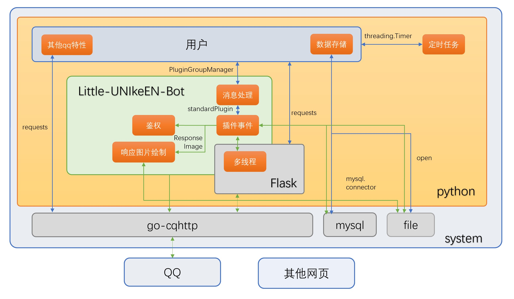
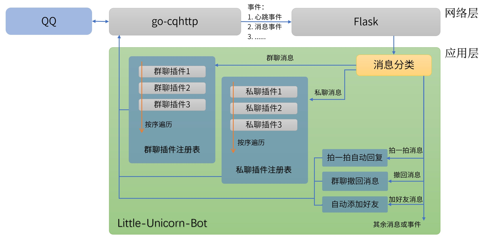

`version 1.1.0`
# 1. 简介

Little-UNIkeEN-Bot 是一个由 Python 编写的轻量级、可扩展的QQ机器人前端，底层基于 go-cqhttp、flask、mysql 等第三方依赖。

# 2. 项目架构图

1. 红框标注的是用户（插件开发者）需求
2. 蓝线标注的是需要用户自行调用或编写的逻辑
3. 绿线标注的是bot封装好的逻辑

# 3. 运行流程图

