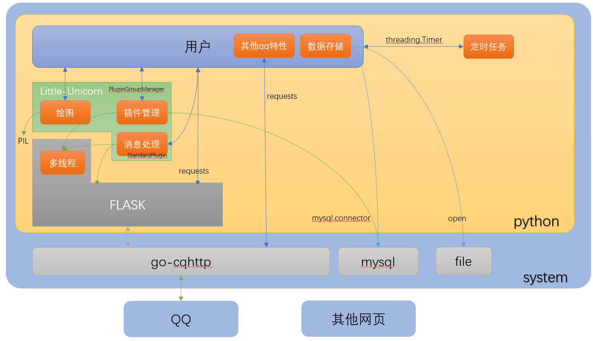

`version 1.0.0`
# 1. 简介

Little-UNIkeEN-Bot 是一个由 Python 编写的轻量级、可扩展的QQ机器人前端，底层基于go-cqhttp、FLASK、mysql这几个第三方依赖。

# 2. 项目架构图

1. 红框标注的是用户需求
2. 蓝线标注的是需要用户自行调用或编写的逻辑
3. 绿线标注的是bot封装好的逻辑

# 3. 运行流程图

TBD

# 4. 为什么会有本项目

2022年暑假，周围的朋友受某种风气影响，纷纷跑去开发QQ聊天机器人，其中大部分人选择nonebot作为基础框架。作为后来者，我观察到：他们在使用用nonebot后，还纷纷跑去看go-cqhttp文档，甚至有几个抱怨nonebot封装太深。受此影响，我便打算只基于go-cqhttp开发一套qq机器人出来。

一个月后，Little-UNIkeEN-Bot大致成型。我作为后来者，开发出的功能比那几个先到者的还要多。因此，我便考虑将这个项目继续做大。接下来一个月，我打磨架构、引进技术、开发新插件，顺利地把bot修到更进一步的高度。同时，我也开始思考一个哲学问题：

> onebot是一个好方案吗？

我思考了好久，最后认定这并不是一个好方案。原因如下：

onebot协议主打跨平台，目前nonebot也确实实现了，但是平台之间的内容异质性是中间层软件无法抹平的。比如qq的表情、at、戳一戳，形状如`[cq:xxx,id=xxx]`；钉钉的富文本，格式更不好描述。如果需要开发者自己抹除内容异质性，那么扛起跨平台大旗的中间层也没有生存的的必要了；如果中间层抹除了内容异质性，那么就需要自己制定大量标准、编写大量函数、频繁修改代码对接底层，这样做既丧失了版本稳定性，更需要消耗开发者大量精力去学习你自己制定的接口，有种“自己玩自己的”的感觉。更失望的是，阿里腾讯可不听我们这些bot开发人员的呼声，异质性内容还会更多更频繁地在未来出现。

nonebot是遵守onebot协议的，自然能看出其缺点：封装深要求多、开发成本过高、版本不稳定、QQ独特的内容不能完美表达(比如精华消息等)....

因此，我更加坚定了推出一套完整项目的决心。我开始召集小伙伴写插件、写文档、深度打磨架构....

直到，我们隆重推出本项目的`1.0.0`版本！

# 5. 我们的优势和不足

nonebot是Little-UNIkeEN-Bot的主要竞品之一，相比nonebot，我们的优势有：

1. 核心代码小于1000行，架构简单、逻辑清晰
2. 在编程层面屏蔽多线程，极大地减少开发难度
3. 建议用户直接与qq驱动对话，底层丰富功能即学即用
4. 不用跨过中间层，能直接接受gocq的dict格式消息、使用python库定时等，减少学习、开发成本
5. 消息封装简单，插件示例丰富，功能轻松编写
6. 给内容生产者提供sql存储、PIL光栅化服务，大大增加生产效率

我们的不足有：

1. 非跨平台，目前官方库仅支持qq(不过已经有其他作者开发了微信版本)
2. 在开发进阶插件时，需要开发者额外学习mysql、阅读go-cqhttp文档
3. 我们刚刚开源，社区建设并不完善

我们和nonebot的差异：

1. 我们的定位是qq机器人前端，nonebot的定位是多聊天软件中间层&前端

nonebot2友情链接：[文档](https://nb2.baka.icu/)，[代码](https://github.com/nonebot/nonebot2)