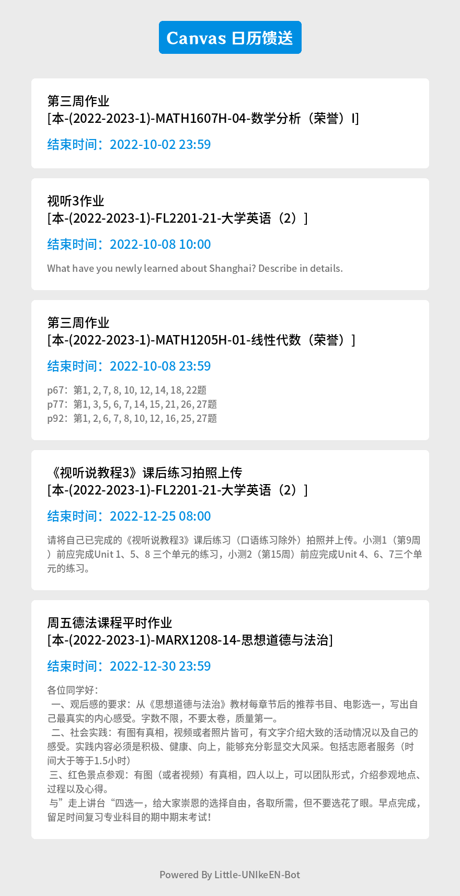

## 1. 插件简介

| 插件名称 | 父类 | 触发关键词 | 触发权限 | 内容 |
| ---- | ---- | ---- | ---- | ---- |
| CanvasiCalBind | StandardPlugin | '-ics bind ${url}' | None | 绑定canvas ics链接 |
| CanvasiCalUnbind | StandardPlugin | '-ics unbind' | None | 解绑canvas ics链接 |
| GetCanvas | StandardPlugin | '-ddl' / '-canvas' | None | 获取canvas日历馈送 |

## 2. 示范样例

代码部分：

```python
ROOT_ADMIN_ID = [111, # 用户A  
                 222, # 用户B
                 444] # 用户D
GroupPluginList = [ # 群聊启用插件
    # .....
    PluginGroupManager([GetCanvas(), CanvasiCalBind(), CanvasiCalUnbind()], 'canvas'), # 日历馈送
    # .....
]
PrivatePluginList=[ # 私聊启用插件
    # .....
    GetCanvas(), CanvasiCalBind(), CanvasiCalUnbind()
    # .....
]
```

群聊部分：

```bash
# 群内尚未打开canvas
333> -ddl
# 无事发生

# 接下来管理员打开canvas
111> -grpcfg enable canvas
bot> OK

# 此时用户C尚未绑定ics url
333> -ddl
bot>    查询失败
        请群聊或私聊使用-ics bind ${url} 绑定您的Canvas iCal馈送链接
        ${url}可在 canvas - 日历📅 - 日历馈送 中获取

# 用户C绑定canvas
333> -ics bind ${用户C的icsUrl}
bot> OK
333> -ddl
bot> ${333的canvas日历图片}

# 用户C解绑后查询
333> -ics unbind
bot> OK
333> -ddl
bot>    查询失败
        请群聊或私聊使用-ics bind ${url} 绑定您的Canvas iCal馈送链接
        ${url}可在 canvas - 日历📅 - 日历馈送 中获取
```

图片展示：



## 3. 代码分析

!!! warning "注意：旧的绘图代码"
    这是早期完成的插件，绘图部分代码并未使用推荐的 responseImage 库

```python
from utils.standardPlugin import StandardPlugin, Any, Union
import requests
from utils.basicEvent import *
from utils.basicConfigs import *
from pathlib import Path
import json
from icalendar import Calendar
from datetime import datetime, timedelta
import re
import mysql.connector
class CanvasiCalUnbind(StandardPlugin):
    def judgeTrigger(self, msg: str, data: Any) -> bool:
        return msg.strip() == '-ics unbind'
    def executeEvent(self, msg: str, data: Any) -> Union[None, str]:
        target = data['group_id'] if data['message_type']=='group' else data['user_id']
        if unbind_ics(data['user_id']):
            send(target,"解绑成功", data['message_type'])
        else:
            send(target,"解绑失败", data['message_type'])
        return "OK"
    def getPluginInfo(self, )->Any:
        return {
            'name': 'CanvasiCalUnbind',
            'description': 'canvas日历解绑',
            'commandDescription': '-ics unbind',
            'usePlace': ['group', 'private'],
            'showInHelp': True,
            'pluginConfigTableNames': [],
            'version': '1.0.0',
            'author': 'Unicorn',
        }
class CanvasiCalBind(StandardPlugin): 
    def __init__(self) -> None:
        # 外部服务，防止sql注入、url注入
        self.urlRegex = re.compile(r'https://(oc.sjtu.edu.cn|jicanvas.com)/feeds/calendars/user_[a-zA-Z0-9]{40}.ics')
        # 检查sql是否开了BOT_DATA.canvasIcs
        try:
            mydb = mysql.connector.connect(**sqlConfig)
            mycursor = mydb.cursor()
            mycursor.execute("""create table if not exists `BOT_DATA`.`canvasIcs` (
                `qq` bigint not null,
                `icsUrl` char(128) not null,
                primary key (`qq`)
            );""")
        except BaseException as e:
            warning('canvas ics 无法连接至数据库, error: {}'.format(e))
    def judgeTrigger(self, msg:str, data:Any) -> bool:
        return startswith_in(msg, ['-ics bind '])
    def executeEvent(self, msg:str, data:Any) -> Union[None, str]:
        msg=msg.replace('-ics bind','',1).strip()
        target = data['group_id'] if data['message_type']=='group' else data['user_id']
        if self.urlRegex.match(msg) == None or len(msg) > 110:
            send(target,'格式错误，请检查ics链接符合格式:\n'+
                r're.compile(r"https://(oc.sjtu.edu.cn|jicanvas.com)/feeds/calendars/user_[a-zA-Z0-9]{40}.ics")'+
                "\n【已做防注入处理】", data['message_type'])
        else:
            if edit_bind_ics(data['user_id'], msg):
                send(target,"绑定成功", data['message_type'])
            else:
                send(target,"绑定失败", data['message_type'])
        return "OK"
    def getPluginInfo(self, )->Any:
        return {
            'name': 'CanvasiCalBind',
            'description': 'canvas日历绑定',
            'commandDescription': '-ics bind [url]',
            'usePlace': ['group', 'private'],
            'showInHelp': True,
            'pluginConfigTableNames': [],
            'version': '1.0.0',
            'author': 'Unicorn',
        }
class GetCanvas(StandardPlugin): 
    def judgeTrigger(self, msg:str, data:Any) -> bool:
        return msg.strip() in ['-ddl', '-canvas']
    def executeEvent(self, msg:str, data:Any) -> Union[None, str]:
        ret = getCanvas(data['user_id'])
        target = data['group_id'] if data['message_type']=='group' else data['user_id']
        if not ret[0]:
            send(target ,ret[1], data['message_type'])
        else:
            canvasPicPath = os.path.join(ROOT_PATH, ret[1])
            send(target,f'[CQ:image,file=files://{canvasPicPath},id=40000]', data['message_type'])
        return "OK"
    def getPluginInfo(self, )->Any:
        return {
            'name': 'GetCanvas',
            'description': 'canvas活动查询',
            'commandDescription': '-ddl/-canvas',
            'usePlace': ['group', 'private', ],
            'showInHelp': True,
            'pluginConfigTableNames': ['canvasIcs'],
            'version': '1.0.0',
            'author': 'Unicorn',
        }
def unbind_ics(qq_id: Union[int, str])->bool:
    if isinstance(qq_id, str):
        qq_id = int(qq_id)
    try:
        mydb = mysql.connector.connect(**sqlConfig)
        mycursor = mydb.cursor()
        mycursor.execute("delete from `BOT_DATA`.`canvasIcs` where qq=%d"%(qq_id))
        mydb.commit()
        return True
    except BaseException as e:
        warning("error in canvasSync, error: {}".format(e))
        return False

def edit_bind_ics(qq_id: Union[int, str], ics_url: str)->bool:
    if isinstance(qq_id, str):
        qq_id = int(qq_id)
    try:
        mydb = mysql.connector.connect(**sqlConfig)
        mycursor = mydb.cursor()
        mycursor.execute("replace into `BOT_DATA`.`canvasIcs` values (%d, '%s')"%(qq_id, escape_string(ics_url)))
        mydb.commit()
        return True
    except BaseException as e:
        warning("error in canvasSync, error: {}".format(e))
        return False

FAIL_REASON_1="请群聊或私聊使用-ics bind ${url} 绑定您的Canvas iCal馈送链接\n ${url}可在 canvas - 日历📅 - 日历馈送 中获取"
FAIL_REASON_2="无法获取或解析日历文件"

def getCanvas(qq_id) -> Tuple[bool, str]:
    if isinstance(qq_id, str):
        qq_id = int(qq_id)
    try:
        mydb = mysql.connector.connect(**sqlConfig)
        mycursor = mydb.cursor()
        mycursor.execute("select icsUrl from `BOT_DATA`.`canvasIcs` where qq=%d"%(qq_id))
        urls = list(mycursor)
        if len(urls) == 0:
            return False, f"查询失败\n{FAIL_REASON_1}"
        else:
            url = urls[0][0]
    except BaseException as e:
        warning("error in canvasSync, error: {}".format(e))
    qq_id=str(qq_id)
    try:
        ret = requests.get(url=url)
        data = ret.content
        gcal = Calendar.from_ical(data)
        event_list = []
        for component in gcal.walk():
            if component.name == "VEVENT":
                now = time.localtime()
                ddl_time = component.get('dtend').dt
                if not isinstance(ddl_time,datetime):
                    tmp=datetime.strftime(ddl_time,"%Y-%m-%d")+" 23:59:59"
                    ddl_time = datetime.strptime(tmp,"%Y-%m-%d %H:%M:%S")
                else:
                    ddl_time+=timedelta(hours=8)
                    tmp = datetime.strftime(ddl_time, "%Y-%m-%d %H:%M:%S")
                if time.mktime(time.strptime(tmp, "%Y-%m-%d %H:%M:%S")) < time.mktime(now):
                    continue
                ddl_time = datetime.strftime(ddl_time,"%Y-%m-%d %H:%M")
                event_list.append([component.get('summary'), component.get('description'), ddl_time])
        return True, DrawEventListPic(event_list, qq_id)
    except Exception as e:
        print(e)
        return False, f"查询失败\n{FAIL_REASON_2}"

def DrawEventListPic(event_list, qq_id):
    proceed_list = []
    width=880
    h_title, h_des = 0, 0
    for summary, description, deadline in event_list[:10]:
        # print(description.replace('\n','-sep-'))
        if description==None:
            description = ''
        h_block=0 #块内动态高度
        txt_line=""
        title_parse=[]
        summary = summary.replace('[本-', '\n[本-')
        for word in summary:
            if txt_line=="" and word in ['，','；','。','、','"','：','.','”']: #避免标点符号在首位
                title_parse[-1]+=word
                continue
            txt_line+=word
            if font_syhtmed_24.getsize(txt_line)[0]>width-180:
                title_parse.append(txt_line)
                txt_line=""
            if word=='\n':
                title_parse.append(txt_line)
                txt_line=""
                continue
        if txt_line!="":
            title_parse.append(txt_line)
        h_title+=len(title_parse)*33

        txt_line=""
        description_parse=[]
        description_re = re.sub('\n+','\n', description)
        description_re = description_re.replace('\xa0','')
        for word in description_re:
            if txt_line=="" and word in ['，','；','。','、','"','：','.','”']: #避免标点符号在首位
                description_parse[-1]+=word
                continue
            txt_line+=word
            if font_syhtmed_18.getsize(txt_line)[0]>width-180:
                description_parse.append(txt_line)
                txt_line=""
            if word=='\n':
                description_parse.append(txt_line)
                txt_line=""
                continue
        if txt_line!="":
            description_parse.append(txt_line)
        
        h_des+=len(description_parse)*27
        # print(description_parse)
        h_block+=(len(title_parse)*33+len(description_parse)*27)
        if len(description_parse)==0:
            h_des-=15
            h_block-=15
        proceed_list.append([title_parse, description_parse, deadline, h_block])

    height=len(event_list[:10])*150+190+(240 if len(event_list)==0 else 0)+h_title+h_des+(40 if len(event_list)>10 else 0)
    img, draw, h = init_image_template('Canvas 日历馈送', width, height, (0, 142, 226, 255))
    h+=130
    for title, description, deadline, h_block in proceed_list:
        img = draw_rounded_rectangle(img, x1=60, y1=h, x2=width-60 ,y2=h+120+h_block, fill=(255,255,255,255))
        l = 90
        t = h+30 # 距 块顶 坐标
        for line in title:
            draw.text((l,t), line, fill=(0,0,0,255),font = font_syhtmed_24)
            t+=33
        t+=17
        draw.text((l,t), '结束时间：'+deadline, fill=(0, 142, 226, 255),font = font_syhtmed_24)
        t+=50
        for line in description:
            draw.text((l,t), line, fill=(115,115,115,255),font = font_syhtmed_18)
            t+=27

        h+=(140+h_block)
    if len(event_list)==0:
        img = draw_rounded_rectangle(img, x1=60, y1=h, x2=width-60 ,y2=h+210, fill=(255,255,255,255))
        txt_size=draw.textsize('恭喜你，没有即将到期的ddl~', font = font_syhtmed_32)
        draw.text(((width-txt_size[0])/2+5,h+80), '恭喜你，没有即将到期的ddl~', fill=(0,0,0,255),font = font_syhtmed_32)
    
    if len(event_list)>10:
        txt_size = draw.textsize('日历项太多啦，只显示了前10条qwq',font=font_syhtmed_18)
        draw.text((width/2-txt_size[0]/2, height-85),'日历项太多啦，只显示了前10条qwq', fill=(115,115,115,255) ,font = font_syhtmed_18) 
    
    save_path= os.path.join(SAVE_TMP_PATH, f'{qq_id}_canvas.png')
    img.save(save_path)
    return save_path
```