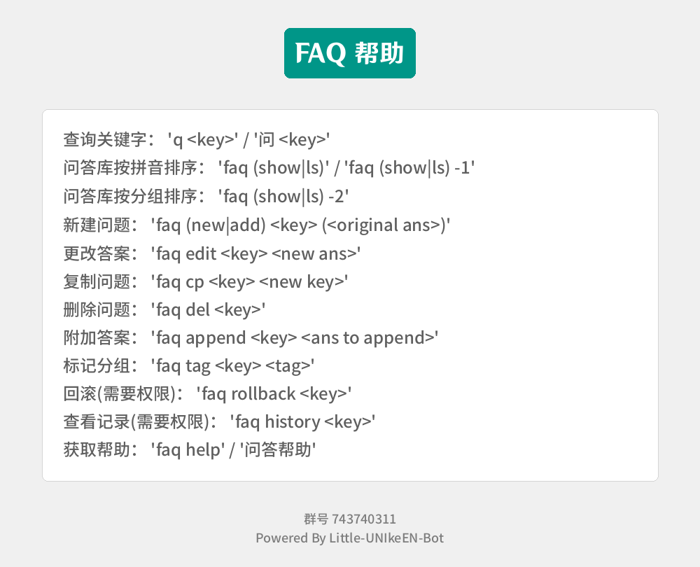
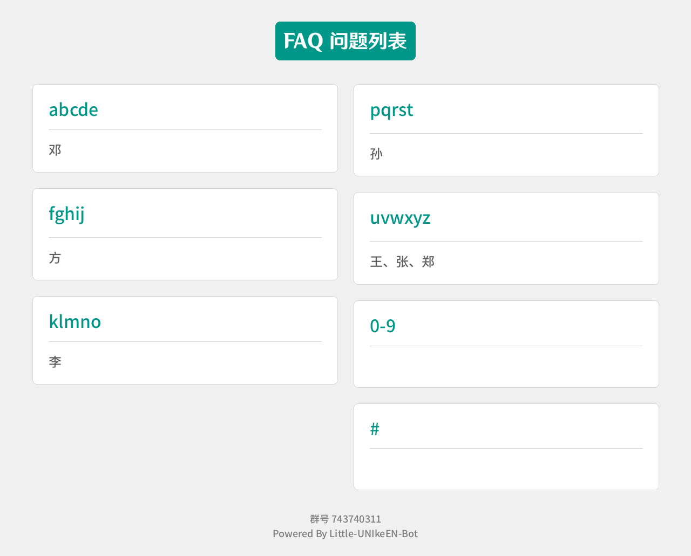
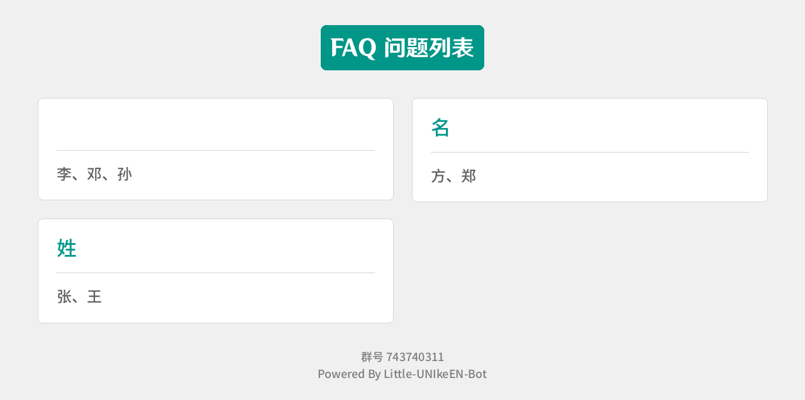
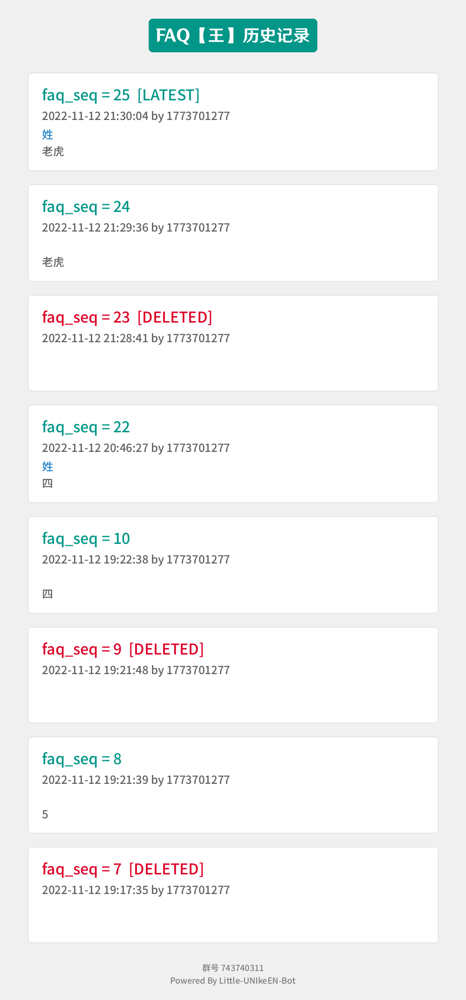

## 1. 插件简介

| 插件名称 | 父类 | 触发关键词 | 触发权限 | 内容 |
| ---- | ---- | ---- | ---- | ---- |
| HelpFAQ | StandardPlugin | 问答帮助 | None | 获取问答帮助 |
| AskFAQ | StandardPlugin | '问 [..]' / 'q [..]' | None | 获取问答内容 |
| MaintainFAQ | StandardPlugin | 'faq [...]' | None | 维护问答库 |

## 2. 示范样例

聊天方面：

```bash
111> -faq help
bot> 【faq帮助图片】
222> faq add sjtu 上海交通大学
bot> [回复上文]上海交通大学 【sjtu】
333> faq edit sjtu 上交
bot> [回复上文]上交 【sjtu】
111> faq cp sjtu 上海交通大学
bot> [回复上文]上交 【上海交通大学】
222> faq del sjtu
bot> [回复上文]问题删除成功
444> faq append 上海交通大学 大
bot> [回复上文]上交大 【上海交通大学】
111> faq show
bot> 【群聊faq总表（按字母排序）】
222> faq ls -2
bot> 【群聊faq总表（按tag排序）】
111> faq history 王
bot> 【question`王`历史】
```

faq帮助图片：



----

群聊faq总表（按字母排序）



----

群聊faq总表（按tag排序）



----

question `王` 历史



## 3. 代码分析

代码位于 plugins/faq_v2.py

```python
FAQ_DATA_PATH="data"
def createFaqTable(tableName: str):
    # warning: tableName may danger
    if not isinstance(tableName, str):
        tableName = str(tableName)
    mydb = mysql.connector.connect(charset='utf8mb4',**sqlConfig)
    mydb.autocommit = True
    mycursor = mydb.cursor()
    mycursor.execute("""
    create table if not exists `BOT_FAQ_DATA`.`%s` (
        `faq_seq` bigint unsigned not null auto_increment,
        `question` varchar(100) not null,
        `latest` bool not null default true,
        `answer` varchar(4000) not null,
        `modify_user_id` bigint not null,
        `modify_time` timestamp not null,
        `group_tag` varchar(100) not null default '',
        `deleted` bool not null default false,
        primary key (`faq_seq`),
        index(`question`, `latest`, `deleted`),
        index(`group_tag`, `latest`, `deleted`)
    )charset=utf8mb4, collate=utf8mb4_unicode_ci;
    """%(
        escape_string(tableName)
    ))

def createFaqDb():
    mydb = mysql.connector.connect(charset='utf8mb4',**sqlConfig)
    mydb.autocommit = True
    mycursor = mydb.cursor()
    mycursor.execute("create database if not exists `BOT_FAQ_DATA`")
    createFaqTable("globalFaq")
class HelpFAQ(StandardPlugin):
    def judgeTrigger(self, msg:str, data:Any) -> bool:
        return msg == '问答帮助' and data['message_type']=='group'
    def executeEvent(self, msg: str, data: Any) -> Union[None, str]:
        group_id = data['group_id']
        picPath = draw_help_pic(group_id)
        picPath = picPath if os.path.isabs(picPath) else os.path.join(ROOT_PATH, picPath)
        send(group_id, '[CQ:image,file=files://%s]'%picPath)
        return "OK"
    def getPluginInfo(self)->Any:
        return {
            'name': 'AskFAQ',
            'description': '问答帮助',
            'commandDescription': '问答帮助',
            'usePlace': ['group', ],
            'showInHelp': True,
            'pluginConfigTableNames': [],
            'version': '1.0.4',
            'author': 'Unicorn',
        }
def get_answer(group_id: int, key: str)->Tuple[bool, str]:
    mydb = mysql.connector.connect(charset='utf8mb4',**sqlConfig)
    mycursor = mydb.cursor()
    mycursor.execute("""
    select `answer` from `BOT_FAQ_DATA`.`%d` where 
        `question` = '%s' and
        `latest` = true and
        `deleted` = false
    """%(
        group_id, 
        escape_string(key),
    ))
    answer = list(mycursor)
    if len(answer) == 0:
        return False, ''
    else:
        return True, answer[0][0]
def rollback_answer(group_id:int, question:str)->bool:
    mydb = mysql.connector.connect(charset='utf8mb4',**sqlConfig)
    mydb.autocommit = True
    mycursor = mydb.cursor()
    try:
        mycursor.execute("""
        select max(`faq_seq`) from `BOT_FAQ_DATA`.`%d` where question = '%s'
        """%(group_id, escape_string(question)))
        faq_seq = list(mycursor)[0][0]
        if faq_seq == None:
            return False
        else:
            mycursor.execute("""
            delete from `BOT_FAQ_DATA`.`%d` where `faq_seq` = %d
            """%(group_id, faq_seq))
            mycursor.execute("""
            update `BOT_FAQ_DATA`.`%d` set `latest` = true where
            `faq_seq` = (
                select * from (
                    select max(`faq_seq`) from `BOT_FAQ_DATA`.`%d`
                    where question = '%s'
                )a
            )
            """%(group_id, group_id, escape_string(question)))
    except mysql.connector.Error as e:
        warning('mysql error in faq rollback_answer: {}'.format(e))
        return False
    except KeyError as e:
        warning("key error in faq rollback_answer: {}".format(e))
        return False
    except BaseException as e:
        warning("exception in faq rollback_answer: {}".format(e))
        return False
    return True
def update_answer(group_id:int, question:str, answer:str, data:Any, tag:str = '',delete:bool= False)->bool:
    mydb = mysql.connector.connect(charset='utf8mb4',**sqlConfig)
    mydb.autocommit = True
    mycursor = mydb.cursor()
    try:
        mycursor.execute("""
        update `BOT_FAQ_DATA`.`%d` 
        set
            `latest` = false
        where
            `question` = '%s' and
            `latest` = true
        """%(
            group_id,
            escape_string(question)
        ))
        mycursor.execute("""
        insert into `BOT_FAQ_DATA`.`%d` (
            `question`, `answer`, `modify_user_id`, `modify_time`, `deleted`, `group_tag`
        ) values (
            '%s', '%s', %d, from_unixtime(%d), %s, '%s'
        )"""%(
            data['group_id'],
            escape_string(question),
            escape_string(answer),
            data['user_id'],
            data['time'],
            'true' if delete else False,
            escape_string(tag)
        ))
    except mysql.connector.Error as e:
        warning('mysql error in faq update_answer: {}'.format(e))
        return False
    except KeyError as e:
        warning("key error in faq update_answer: {}".format(e))
        return False
    except BaseException as e:
        warning("exception in faq update_answer: {}".format(e))
        return False
    return True
class AskFAQ(StandardPlugin):
    def __init__(self):
        self.pattern = re.compile(r'^(问|q)\s+([^\s]+)$')
    def judgeTrigger(self, msg:str, data:Any) -> bool:
        return self.pattern.match(msg) != None and data['message_type']=='group'
    def executeEvent(self, msg:str, data:Any) -> Union[None, str]:
        question = self.pattern.findall(msg)[0][1]
        group_id = data['group_id']
        hasMsg, ans = get_answer(group_id, question)
        if hasMsg:
            ans = "[CQ:reply,id=%d]%s\n【%s】"%(data['message_id'], ans, question)
        else:
            ans = "[CQ:reply,id=%d]未查询到信息"%(data['message_id'])
        send(group_id, ans)

    def getPluginInfo(self)->Any:
        return {
            'name': 'AskFAQ',
            'description': '问答库',
            'commandDescription': '问 [...]',
            'usePlace': ['group', ],
            'showInHelp': True,
            'pluginConfigTableNames': [],
            'version': '1.0.4',
            'author': 'Unicorn',
        }
class MaintainFAQ(StandardPlugin):
    def __init__(self):
        self.findModPattern = re.compile(r"^faq\s+([^\s]+)\s*(.*)$")
        self.modMap = {
            'show': MaintainFAQ.faqShow,
            'ls': MaintainFAQ.faqShow,
            'new': MaintainFAQ.faqAdd,
            'add': MaintainFAQ.faqAdd,
            'edit': MaintainFAQ.faqEdit,
            'cp': MaintainFAQ.faqCp,
            'del': MaintainFAQ.faqDel,
            'append': MaintainFAQ.faqAppend,
            'tag': MaintainFAQ.faqTag,
            'rollback': MaintainFAQ.faqRollBack,
            'history': MaintainFAQ.faqHistory,
            'help': MaintainFAQ.faqHelp,
        }
    def judgeTrigger(self, msg:str, data:Any) -> bool:
        return self.findModPattern.match(msg) != None and data['message_type']=='group'
    def executeEvent(self, msg:str, data:Any) -> Union[None, str]:
        mod, cmd = self.findModPattern.findall(msg)[0]
        if mod in self.modMap.keys():
            self.modMap[mod](cmd, data)
        else:
            send(data['group_id'], '输入格式不对哦，请输入【问答帮助】获取操作指南')
        return "OK"
    def getPluginInfo(self)->Any:
        return {
            'name': 'MaintainFAQ',
            'description': '维护问答库',
            'commandDescription': 'faq <mod> [...]',
            'usePlace': ['group', ],
            'showInHelp': True,
            'pluginConfigTableNames': [],
            'version': '1.0.4',
            'author': 'Unicorn',
        }
    @staticmethod
    def faqShow(cmd: str, data):
        mydb = mysql.connector.connect(charset='utf8mb4',**sqlConfig)
        mydb.autocommit = True
        mycursor = mydb.cursor()
        groupId = data['group_id']
        if cmd == '' or cmd == '-1':
            mycursor.execute("""select `question` from `BOT_FAQ_DATA`.`%d`
            where latest = true and deleted = false
            """%groupId)
            questions = [q[0] for q in list(mycursor)]
            picPath = drawQuestionCardByPinyin(questions, groupId)
            picPath = picPath if os.path.isabs(picPath) else os.path.join(ROOT_PATH, picPath)
            send(groupId, '[CQ:image,file=files://%s,id=40000]'%picPath)
        elif cmd == '-2':
            mycursor.execute("""select `group_tag`, `question` from `BOT_FAQ_DATA`.`%d`
            where latest = true and deleted = false
            """%groupId)
            questions: Dict[str, List[str]] = {}
            for tag, q in list(mycursor):
                if tag not in questions.keys():
                    questions[tag] = [q]
                else:
                    questions[tag].append(q)
            picPath = drawQuestionCardByTag(questions, groupId)
            picPath = picPath if os.path.isabs(picPath) else os.path.join(ROOT_PATH, picPath)
            send(groupId, '[CQ:image,file=files://%s,id=40000]'%picPath)
        else:
            send(groupId, "语法有误，支持语句为: faq show(/ -1/ -2)")
        
    @staticmethod
    def faqAdd(cmd: str, data):
        pattern = re.compile(r'^([^\s]+)\s*(.*)$')
        qa = pattern.findall(cmd)
        groupId = data['group_id']
        if len(qa) == 0:
            send(groupId, '语法有误，支持语句为: faq (new/add) <key> (<ans>)')
        else:
            question, answer = qa[0]
            status, _ = get_answer(groupId, question)
            if status:
                send(groupId, '[CQ:reply,id=%d]问题【%s】已经存在'%(data['message_id'], question))
            else:
                status = update_answer(groupId, question, answer, data)
                if status:
                    send(groupId, "[CQ:reply,id=%d]%s\n【%s】"%(data['message_id'], answer, question))
                else:
                    send(groupId, '[CQ:reply,id=%d]更新失败'%data['message_id'])
            
    @staticmethod
    def faqEdit(cmd: str, data):
        pattern = re.compile(r'^([^\s]+)\s*(.*)$')
        qa = pattern.findall(cmd)
        groupId = data['group_id']
        if len(qa) == 0:
            send(groupId, '语法有误，支持语句为: faq edit <key> <ans>')
        else:
            question, answer = qa[0]
            status, _ = get_answer(groupId, question)
            if not status:
                send(groupId, '[CQ:reply,id=%d]问题不存在，请先使用"faq add"语句创建该问题'%data['message_id'])
            else:
                status = update_answer(groupId, question, answer, data)
                if status:
                    send(groupId, "[CQ:reply,id=%d]%s\n【%s】"%(data['message_id'], answer, question))
                else:
                    send(groupId, '[CQ:reply,id=%d]更新失败'%data['message_id'])
    @staticmethod
    def faqCp(cmd: str, data):
        pattern = re.compile(r'^([^\s]+)\s+([^\s]+)$')
        qa = pattern.findall(cmd)
        groupId = data['group_id']
        if len(qa) == 0:
            send(groupId, '语法有误，支持语句为: faq cp <name> <new name>')
        else:
            prevName, newName = qa[0]
            status, answer = get_answer(groupId, prevName)
            if not status:
                send(groupId,"[CQ:reply,id=%d]【%s】问题不存在"%(data['message_id'], prevName))
            else:
                status = update_answer(groupId, newName, answer, data)
                if status:
                    send(groupId, "[CQ:reply,id=%d]%s\n【%s】"%(data['message_id'], answer, newName))
                else:
                    send(groupId, '[CQ:reply,id=%d]问题复制失败'%data['message_id'])
    @staticmethod
    def faqDel(cmd: str, data):
        pattern = re.compile(r'^([^\s]+)\s*$')
        question = pattern.findall(cmd)
        groupId = data['group_id']
        if len(question) == 0:
            send(groupId, '语法有误，支持语句为: faq del <key>')
        else:
            question = question[0][0]
            status, _ = get_answer(groupId, question)
            if not status:
                send(groupId, "[CQ:reply,id=%d]问题不存在"%(data['message_id']))
            else:
                status = update_answer(groupId, question, '', data, delete=True)
                if status:
                    send(groupId, "[CQ:reply,id=%d]问题删除成功"%(data['message_id']))
                else:
                    send(groupId, "[CQ:reply,id=%d]问题删除失败"%(data['message_id']))
    @staticmethod
    def faqAppend(cmd: str, data):
        pattern = re.compile(r'^([^\s]+)\s(.*)$')
        qa = pattern.findall(cmd)
        groupId = data['group_id']
        if len(qa) == 0:
            send(groupId, '语法有误，支持语句为: faq append <key> <ans to append>')
        else:
            question, answer = qa[0]
            status, prevAns = get_answer(groupId, question)
            if not status:
                send(groupId,"[CQ:reply,id=%d]【%s】问题不存在"%(data['message_id'], question))
            else:
                answer = prevAns + answer
                status = update_answer(groupId, question, answer, data)
                if status:
                    send(groupId, "[CQ:reply,id=%d]%s\n【%s】"%(data['message_id'], answer, question))
                else:
                    send(groupId, '[CQ:reply,id=%d]更新失败'%data['message_id'])
    @staticmethod
    def faqTag(cmd: str, data):
        pattern = re.compile(r'^([^\s]+)\s+([^\s]+)$')
        qa = pattern.findall(cmd)
        groupId = data['group_id']
        if len(qa) == 0:
            send(groupId, '语法有误，支持语句为: faq tag <key> <tag>')
        else:
            question, tag = qa[0]
            status, answer = get_answer(groupId, question)
            if not status:
                send(groupId,"[CQ:reply,id=%d]【%s】问题不存在"%(data['message_id'], question))
            else:
                status = update_answer(groupId, question, answer, data, tag=tag)
                if status:
                    send(groupId, "[CQ:reply,id=%d]OK"%(data['message_id']))
                else:
                    send(groupId, '[CQ:reply,id=%d]更新失败'%data['message_id'])
    @staticmethod
    def faqRollBack(cmd: str, data):
        groupId = data['group_id']
        pattern = re.compile(r'^([^\s]+)$')
        question = pattern.findall(cmd)
        if len(question) == 0:
            send(groupId, '语法有误，支持语句为: faq rollback <key>')
        else:
            if data['user_id'] not in getGroupAdmins(groupId):
                send(groupId, '[CQ:reply,id=%d]您没有回滚记录权限'%(data['message_id']))
            else:
                question = question[0]
                status = rollback_answer(groupId, question)
                if status:
                    send(groupId, '[CQ:reply,id=%d]OK'%data['message_id'])
                else:
                    send(groupId, '[CQ:reply,id=%d]记录【%s】不存在'%(data['message_id'], question))
    @staticmethod
    def faqHistory(cmd: str, data):
        groupId = data['group_id']
        pattern = re.compile(r'^([^\s]+)$')
        question = pattern.findall(cmd)
        if len(question) == 0:
            send(groupId, '语法有误，支持语句为: faq history <key>')
        else:
            if data['user_id'] not in getGroupAdmins(groupId):
                send(groupId, '[CQ:reply,id=%d]您没有查看记录权限'%(data['message_id']))
            else:
                question = question[0]
                picPath = draw_answer_history(groupId, question)
                picPath = picPath if os.path.isabs(picPath) else os.path.join(ROOT_PATH, picPath)
                send(groupId, '[CQ:image,file=files://%s,id=40000]'%picPath)
    @staticmethod
    def faqHelp(cmd: str, data):
        groupId = data['group_id']
        picPath = draw_help_pic(groupId)
        picPath = picPath if os.path.isabs(picPath) else os.path.join(ROOT_PATH, picPath)
        send(groupId, '[CQ:image,file=files://%s]'%picPath)

def drawQuestionCardByPinyin(questions: List[str], group_id: int)->str:
    """绘制问答列表图像
    @questions: 问题列表
    """
    questions = sorted(questions, key=lambda x: lazy_pinyin(x[0])[0].lower())
    letterGroups = {'abcde': [], 'fghij': [], 'klmno': [], 'pqrst': [], 'uvwxyz': [], '0-9': [], '#': []}
    for q in questions:
        firstLetter = lazy_pinyin(q[0])[0][0].lower()
        firstLetter = ord(firstLetter)
        if firstLetter >= ord('0') and firstLetter <= ord('9'):
            letterGroups['0-9'].append(q)
        elif firstLetter >= ord('a') and firstLetter <= ord('e'):
            letterGroups['abcde'].append(q)
        elif firstLetter >= ord('f') and firstLetter <= ord('j'):
            letterGroups['fghij'].append(q)
        elif firstLetter >= ord('k') and firstLetter <= ord('o'):
            letterGroups['klmno'].append(q)
        elif firstLetter >= ord('p') and firstLetter <= ord('t'):
            letterGroups['pqrst'].append(q)
        elif firstLetter >= ord('u') and firstLetter <= ord('z'):
            letterGroups['uvwxyz'].append(q)
        else:
            letterGroups['#'].append(q)

    helpCards = ResponseImage(
        title = 'FAQ 问题列表', 
        titleColor = PALETTE_CYAN,
        layout = 'two-column',
        width = 1280,
        cardBodyFont= ImageFont.truetype(os.path.join(FONTS_PATH, 'SourceHanSansCN-Medium.otf'), 24),
        footer='群号 %d'%group_id
    )
    for k, v in letterGroups.items():
        cardList = []
        cardList.append(('title', k))
        cardList.append(('separator', ))
        cardList.append(('body', "、".join(v)))
        helpCards.addCard(ResponseImage.RichContentCard(
            raw_content=cardList, titleFontColor=PALETTE_CYAN))
    savePath = os.path.join(SAVE_TMP_PATH, '%d-faq.png'%group_id)
    helpCards.generateImage(savePath)
    return savePath
def drawQuestionCardByTag(questions:Dict[str, List[str]], group_id: int)->str:
    """
    @questions: {
        'tag0': [question00, question01, ...],
        'tag1': [question10, question11, ...],
    }
    @group_id:  群号
    """
    helpCards = ResponseImage(
        title = 'FAQ 问题列表', 
        titleColor = PALETTE_CYAN,
        layout = 'two-column',
        width = 1280,
        cardBodyFont= ImageFont.truetype(os.path.join(FONTS_PATH, 'SourceHanSansCN-Medium.otf'), 24),
        footer='群号 %d'%group_id,
    )
    for tag, qs in questions.items():
        cardList = []
        cardList.append(('title', tag))
        cardList.append(('separator', ))
        cardList.append(('body', "、".join(qs)))
        helpCards.addCard(ResponseImage.RichContentCard(
            raw_content=cardList, titleFontColor=PALETTE_CYAN))
    savePath = os.path.join(SAVE_TMP_PATH, '%d-faq.png'%group_id)
    helpCards.generateImage(savePath)
    return savePath
def draw_answer_history(group_id:int, question:str)->str:
    mydb = mysql.connector.connect(charset='utf8mb4',**sqlConfig)
    mydb.autocommit = True
    mycursor = mydb.cursor()
    try:
        mycursor.execute("""select
        `faq_seq`, `question`, `answer`, `latest`, `deleted`, `modify_user_id`, `modify_time`, `group_tag`
        from `BOT_FAQ_DATA`.`%d` where `question` = '%s'
        order by `faq_seq` desc limit 20
        """%(group_id, escape_string(question)))
    except mysql.connector.Error as e:
        warning('mysql error in faq get_answer_history: {}'.format(e))
        return []
    except KeyError as e:
        warning("key error in faq get_answer_history: {}".format(e))
        return []
    except BaseException as e:
        warning("exception in faq get_answer_history: {}".format(e))
        return []
    helpCards = ResponseImage(
        title = 'FAQ 【%s】 历史记录'%question, 
        titleColor = PALETTE_CYAN,
        width = 1000,
        cardBodyFont= ImageFont.truetype(os.path.join(FONTS_PATH, 'SourceHanSansCN-Medium.otf'), 24),
        footer= '群号 %d'%group_id,
    )
    for faq_seq, question, answer, latest, deleted, modify_user_id, modify_time, group_tag in list(mycursor):
        cardList = []
        title = 'faq_seq = %d'% faq_seq
        if deleted:
            title += '  [DELETED]'
        if latest:
            title += '  [LATEST]'
        cardList.append(('title', title))

        cardList.append(('subtitle', '%s by %d'%(modify_time, modify_user_id)))
        cardList.append(('keyword', group_tag))
        cardList.append(('body', answer))
        helpCards.addCard(ResponseImage.RichContentCard(
            raw_content=cardList,
            titleFontColor=PALETTE_RED if deleted else PALETTE_CYAN,
        ))
    savePath = os.path.join(ROOT_PATH, SAVE_TMP_PATH, '%d-faq-history.png'%(group_id, ))
    helpCards.generateImage(savePath)
    return savePath
def draw_help_pic(group_id:int)->str:
    """绘制faq帮助
    @group_id:  群号
    @return:    图片存储路径
    """
    helpWords = (
        "查询关键字： 'q <key>' / '问 <key>'\n"
        "问答库按拼音排序： 'faq (show|ls)' / 'faq (show|ls) -1'\n"
        "问答库按分组排序： 'faq (show|ls) -2'\n"
        "新建问题： 'faq (new|add) <key> (<original ans>)'\n"
        "更改答案： 'faq edit <key> <new ans>'\n"
        "复制问题： 'faq cp <key> <new key>'\n"
        "删除问题： 'faq del <key>'\n"
        "附加答案： 'faq append <key> <ans to append>'\n"
        "标记分组： 'faq tag <key> <tag>'\n"
        "回滚(需要权限)： 'faq rollback <key>'\n"
        "查看记录(需要权限)： 'faq history <key>'\n"
        "获取帮助： 'faq help' / '问答帮助'\n\n"
    )
    helpCards = ResponseImage(
        title = 'FAQ 帮助', 
        titleColor = PALETTE_CYAN,
        width = 1000,
        cardBodyFont= ImageFont.truetype(os.path.join(FONTS_PATH, 'SourceHanSansCN-Medium.otf'), 24),
        footer='群号 %d'%group_id
    )
    cardList = []
    cardList.append(('body', helpWords))
    helpCards.addCard(ResponseImage.RichContentCard(
        raw_content=cardList,
        titleFontColor=PALETTE_CYAN,
    ))
    savePath = os.path.join(ROOT_PATH, SAVE_TMP_PATH, '%d-faq-helper.png'%(group_id, ))
    helpCards.generateImage(savePath)
    return savePath
```