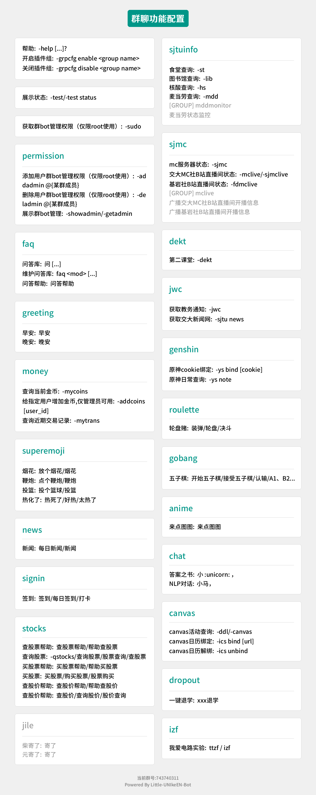

## 1. 插件简介

| 插件名称 | 父类 | 触发关键词 | 触发权限 | 内容 |
| ---- | ---- | ---- | ---- | ---- |
| ShowHelp | StandardPlugin | '-help [...]' | None | 展示 bot 使用方法帮助 |
| ShowStatus | StandardPlugin | '-test' | None | 展示测试信息 |

# 2. 具体使用说明

插件列表由 `PluginGroupManager` 和 `StandardPlugin` 嵌套而成，help模块不仅支持常规查询，还支持嵌套查询。

help格式如下：

> 1. 显示所有插件帮助：-help
> 2. 显示某个嵌套路径：-help 名称1 名称2 ...

常规查询格式如 `1.` 所示，显示的是所有插件的帮助信息。

嵌套查询格式如 `2.` 所示，显示的是这个嵌套路径下插件的帮助信息。

# 3. 示范样例

代码部分：

```python
helper = ShowHelp() # 帮助插件
GroupPluginList:List[StandardPlugin]=[ # 指定群启用插件
    groupMessageRecorder,
    helper,
    # ...
]
PrivatePluginList:List[StandardPlugin]=[ # 私聊启用插件
    helper,
    # ...
]
helper.updatePluginList(GroupPluginList, PrivatePluginList)
```

聊天部分：

```bash
私聊：
111> -help
bot> 【帮助图片0】

群聊：
111> -help
bot> 【帮助图片1】
111> -grpcfg disable sjmc
bot> [回复上文]OK
222> -help
bot> 【帮助图片2】
222> -help sjmc
bot> 【帮助图片3】
```

帮助图片1：


# 4. 代码分析

```python
class ShowHelp(StandardPlugin): 
    def __init__(self) -> None:
        self.pattern = re.compile(r'^\-help\s*(.*)$')
        self.subdevidePattern = re.compile(r'^([^\s]+)\s+([^\s].*)$')
        self.pluginList = []
        self.pluginListPrivate = []
    def judgeTrigger(self, msg:str, data:Any) -> bool:
        return self.pattern.match(msg) != None
    def executeEvent(self, msg:str, data:Any) -> Union[None, str]:
        target = data['group_id'] if data['message_type']=='group' else data['user_id']
        group_id = data['group_id'] if data['message_type']=='group' else 0
        helpWords = self.pattern.findall(msg)[0]
        def getTargetPluginList(pluginList:List[StandardPlugin], helpWords:str)->List[StandardPlugin]:
            if helpWords == '':
                return pluginList
            if self.subdevidePattern.match(helpWords) != None:
                currentPlugin, nextHelpWords = self.subdevidePattern.findall(helpWords)[0]
                for p in pluginList:
                    if not isinstance(p, PluginGroupManager): continue
                    p: PluginGroupManager
                    if p.groupName == currentPlugin:
                        return getTargetPluginList(p.plugins, nextHelpWords)
                return []
            else:
                for p in pluginList:
                    if not isinstance(p, PluginGroupManager): continue
                    p: PluginGroupManager
                    if p.groupName == helpWords:
                        return p.plugins
                return []
        targetPluginList = self.pluginList if data['message_type']=='group' else self.pluginListPrivate
        targetPluginList = getTargetPluginList(targetPluginList, helpWords)
        if len(targetPluginList) == 0:
            send(target, '[CQ:reply,id=%d]暂未创建对应名称的模块'%data['message_id'], data['message_type'])
        else:
            imgPath = drawHelpCard(targetPluginList, group_id)
            imgPath = imgPath if os.path.isabs(imgPath) else os.path.join(ROOT_PATH, imgPath)
            send(target, '[CQ:image,file=files://%s]'%imgPath, data['message_type'])
        return "OK"
    def getPluginInfo(self, )->Any:
        return {
            'name': 'ShowHelp',
            'description': '帮助',
            'commandDescription': '-help [...]?'
                '\n开启插件组:  -grpcfg enable <group name>'
                '\n关闭插件组:  -grpcfg disable <group name>',
            'usePlace': ['group', 'private', ],
            'showInHelp': True,
            'pluginConfigTableNames': [],
            'version': '1.0.4',
            'author': 'Unicorn',
        }
    def updatePluginList(self, plugins, private_plugins):
        for plugin in plugins:
            if issubclass(type(plugin), StandardPlugin):
                self.pluginList.append(plugin)
            else:
                warning("unexpected plugin {} type in ShowHelp plugin".format(plugin))
        for plugin in private_plugins:
            if issubclass(type(plugin), StandardPlugin):
                self.pluginListPrivate.append(plugin)
            else:
                warning("unexpected plugin {} type in ShowHelp plugin".format(plugin))

def drawHelpCard(pluginList, group_id):
    helpCards = ResponseImage(
        title = '群聊功能配置' if group_id!=0 else '私聊功能配置', 
        footer = (f'当前群号:{group_id}' if group_id!=0 else ''),
        titleColor = PALETTE_CYAN,
        layout = 'two-column',
        width = 1280,
        cardBodyFont= ImageFont.truetype(os.path.join(FONTS_PATH, 'SourceHanSansCN-Medium.otf'), 24),
        cardSubtitleFont= ImageFont.truetype(os.path.join(FONTS_PATH, 'SourceHanSansCN-Medium.otf'), 24),
    )
    for item in pluginList:
        cardPluginList = []
        flag = False
        if isinstance(item, PluginGroupManager):
            item: PluginGroupManager
            flag = item.queryEnabled(group_id)
            cardPluginList.append(('title', item.groupName))
            cardPluginList.append(('separator', ))
            for plugin in item.getPlugins():
                infoDict:dict = plugin.getPluginInfo()
                if 'showInHelp' in infoDict.keys() and not infoDict['showInHelp']:
                    continue
                try:
                    if isinstance(plugin, PluginGroupManager):
                        plugin: PluginGroupManager
                        cardPluginList.append((
                            'body' if plugin.queryEnabled(group_id) else 'subtitle',
                            "[GROUP] "+ plugin.groupName + '\n' +
                                infoDict['description']
                        ))
                    else:
                        cardPluginList.append(('body',(infoDict['description']+':  '+infoDict['commandDescription'])))
                except KeyError:
                    warning('meet KeyError when getting help, plugin: {}'.format(plugin))
        else:
            item: StandardPlugin
            flag = True
            infoDict = item.getPluginInfo()
            if 'showInHelp' in infoDict.keys() and not infoDict['showInHelp']:
                continue
            try:
                cardPluginList.append(('body',(infoDict['description']+':  '+infoDict['commandDescription'])))
            except KeyError:
                warning('meet KeyError when getting help, plugin: {}'.format(item))
        
        if len(cardPluginList)>0:
            clr = PALETTE_GREY if not flag else PALETTE_CYAN
            clr2 = PALETTE_GREY if not flag else PALETTE_BLACK
            helpCards.addCard(ResponseImage.RichContentCard(raw_content=cardPluginList, titleFontColor=clr ,bodyFontColor=clr2,subtitleFontColor=PALETTE_GREY))
    save_path = (os.path.join(SAVE_TMP_PATH, f'{group_id}_help.png'))
    helpCards.generateImage(save_path)
    return save_path
class ShowStatus(StandardPlugin): 
    def judgeTrigger(self, msg:str, data:Any) -> bool:
        return msg in ['-test status', '-test']
    def executeEvent(self, msg:str, data:Any) -> Union[None, str]:
        target = data['group_id'] if data['message_type']=='group' else data['user_id']
        send(target, 'status: online\n'+VERSION_TXT,data['message_type'])
        return "OK"
    def getPluginInfo(self, )->Any:
        return {
            'name': 'ShowStatus',
            'description': '展示状态',
            'commandDescription': '-test/-test status',
            'usePlace': ['group', 'private', ],
            'showInHelp': True,
            'pluginConfigTableNames': [],
            'version': '1.0.0',
            'author': 'Unicorn',
        }
```
