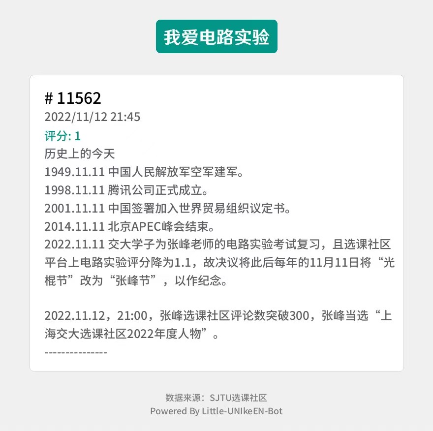

## 1. 插件简介

| 插件名称 | 父类 | 触发关键词 | 触发权限| 内容 |
| ---- | ---- | ---- | ---- | ---- |
| izf | StandardPlugin | '-izf' / '-ttzf' | None | 随机获取选课社区对于《电路实验》的一条评价 |

## 2. 示范样例

```bash
111> -ttzf
bot> 【评价图片】
```

评价图片示例1：

 

评价图片示例2：

 

## 3. 代码分析

```python
from typing import Union, Any
from utils.basicEvent import *
from utils.basicConfigs import *
from utils.responseImage import FONT_SYHT_M32
from utils.standardPlugin import StandardPlugin
from PIL import Image, ImageDraw, ImageFont
import os.path
from utils.responseImage import *
import json
import random

def drawCommentEE0502(t):
    izf = ResponseImage(title='我爱电路实验', 
        primaryColor=PALETTE_CYAN, 
        layout='normal',
        footer='数据来源：SJTU选课社区',
        autoSize=True,
        cardBodyFont=FONT_SYHT_M24,
        width=880)
    izf.addCard(
        ResponseImage.NormalCard(
            title = '# '+str(t['id']),
            keyword = '评分: '+str(t['rating'])+('     成绩: '+str(t['score']) if t['score']!=None else ''),
            subtitle = t['modified'],
            body=t['comment']
        )
    )
    savePath=os.path.join(SAVE_TMP_PATH, "izf.png")
    izf.generateImage(savePath)
    return savePath

class ShowEE0502Comments(StandardPlugin):
    def __init__(self) -> None:
        with open('resources/corpus/izf.json','r',encoding='utf-8') as f:
            zf_data = json.load(f)['results']
        self.resource = zf_data
    def judgeTrigger(self, msg:str, data:Any) -> bool:
        return msg in ['ttzf', 'izf', '-ttzf', '-izf']
    def executeEvent(self, msg:str, data:Any) -> Union[None, str]:
        target = data['group_id'] if data['message_type']=='group' else data['user_id']
        t = random.choice(self.resource)
        picPath = drawCommentEE0502(t)
        picPath = picPath if os.path.isabs(picPath) else os.path.join(ROOT_PATH, picPath)
        send(target, f'[CQ:image,file=files://{picPath}]', data['message_type'])
        return "OK"
    def getPluginInfo(self, )->Any:
        return {
            'name': 'izf',
            'description': '我爱电路实验',
            'commandDescription': 'ttzf / izf',
            'usePlace': ['group', 'private', ],
            'showInHelp': True,
            'pluginConfigTableNames': [],
            'version': '1.0.2',
            'author': 'Unicorn',
        }
```