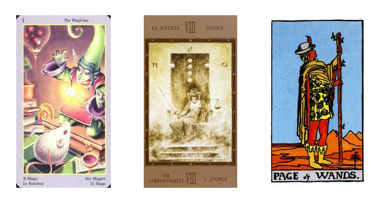

## 1. 插件简介

| 插件名称 | 父类 | 触发关键词 | 触发权限 | 内容 |
| ---- | ---- | ---- | ---- | ---- |
| ThreeKingdomsRandom | StandardPlugin | '判定' | None | 三国杀判定 |
| RandomNum | StandardPlugin | '\[...\]d\[...\]' | None | 生成随机数 |
| TarotRandom | StandardPlugin | '塔罗' / '占卜' | None | 生成三张随机塔罗牌 |

## 2. 样例分析

```
111> 判定
bot> 【回复上文】你的判定结果是【♥3】
111> 判定
bot> 【回复上文】你的判定结果是【♠6】
222> 3d10
bot> 【回复上文】1, 9, 2
111> 0d1
bot> 【回复上文】投掷次数要为正哦~
222> 300d2
bot> 【回复上文】对不起，我只有20个骰子~
333> 塔罗
bot> 【图片】
```



## 3. 代码分析

代码位于 `plugins/randomNum.py`

```python
class ThreeKingdomsRandom(StandardPlugin):
    def __init__(self) -> None:
        # self.flowers = ['红桃', '黑桃', '梅花', '方片']
        self.flowers = ['♥', '♠', '♣', '♦']
        self.points = [ 'A', '2', '3', '4', '5',
                        '6', '7', '8', '9', '10',
                        'J', 'Q', 'K']
    def judgeTrigger(self, msg: str, data) -> bool:
        return msg == '判定'
    def executeEvent(self, msg: str, data) -> Union[None, str]:
        target = data['group_id'] if data['message_type']=='group' else data['user_id']
        result = random.choice(self.flowers) + random.choice(self.points)
        send(target,'[CQ:reply,id=%d]你的判定结果是【%s】'%(data['message_id'], result), data['message_type'])
        return "OK"
    def getPluginInfo(self):
        return {
            'name': 'ThreeKingdomsRandom',
            'description': '三国杀判定',
            'commandDescription': '判定',
            'usePlace': ['group', 'private'],
            'showInHelp': True,
            'pluginConfigTableNames': [],
            'version': '1.0.0',
            'author': 'Unicorn',
        }

class RandomNum(StandardPlugin):
    def __init__(self) -> None:
        self.pattern = re.compile(r'^(\-?\d+)d(\-?\d+)$')
    def judgeTrigger(self, msg: str, data: Any) -> bool:
        return self.pattern.match(msg) != None
    def executeEvent(self, msg: str, data: Any) -> Union[None, str]:
        target = data['group_id'] if data['message_type']=='group' else data['user_id']
        times, maxNum = self.pattern.findall(msg)[0]
        times = int(times)
        maxNum = int(maxNum)
        if times > 20:
            result = '对不起，我只有20个骰子~'
        elif times <= 0:
            result = '投掷次数要为正哦~'
        elif maxNum <= 0:
            result = '骰子最大点数必须是正数哦~'
        elif maxNum > 120:
            result = '对不起，我只能制作最多120个面的骰子~'
        else:
            result = ', '.join([str(random.randint(1, maxNum)) for _ in range(times)])
        send(target,'[CQ:reply,id=%d]%s'%(data['message_id'], result), data['message_type'])
        return 'OK'
    def getPluginInfo(self):
        return {
            'name': 'RandomNum',
            'description': '随机数生成',
            'commandDescription': '[骰子个数]d[骰子面数]',
            'usePlace': ['group', 'private'],
            'showInHelp': True,
            'pluginConfigTableNames': [],
            'version': '1.0.0',
            'author': 'Unicorn',
        }

class TarotRandom(StandardPlugin):
    def __init__(self) -> None:
        self.resourcePath = './resources/tarot'
        self.resource:dict = json.load(open(os.path.join(self.resourcePath, 'tarot.json'),'r'))
    def judgeTrigger(self, msg: str, data: Any) -> bool:
        return msg in ['占卜', '塔罗', '塔罗占卜']
    def executeEvent(self, msg: str, data: Any) -> Union[None, str]:
        target = data['group_id'] if data['message_type']=='group' else data['user_id']
        group_id = data['group_id'] if data['message_type']=='group' else 0
        user_id = data['user_id']
        folders = random.sample(self.resource.keys(), 3)
        imgNames = [os.path.join(self.resourcePath, random.choice(self.resource[f])) for f in folders]
        imgs = [Image.open(f) for f in imgNames]
        im = draw_tarot(imgs)
        picPath = os.path.join(ROOT_PATH, SAVE_TMP_PATH, 'tarot_%d_%d.png'%(group_id, user_id))
        im.save(picPath)
        send(target, f'[CQ:image,file=files://{picPath}]', data['message_type'])
        return "OK"
    def getPluginInfo(self):
        return {
            'name': 'TarotRandom',
            'description': '塔罗牌占卜',
            'commandDescription': '占卜/塔罗',
            'usePlace': ['group', 'private'],
            'showInHelp': True,
            'pluginConfigTableNames': [],
            'version': '1.0.0',
            'author': 'Unicorn',
        }
def draw_tarot(tarots:List[Image.Image])->Image.Image:
    w, h = (750, 400)
    w_i = w / len(tarots)
    img = Image.new('RGBA', (w, h), PALETTE_WHITE)
    for idx, tarot in enumerate(tarots):
        tarot: Image.Image
        cell_center_x = w_i / 2 + idx * w_i
        cell_center_y = h / 2
        tarot_x = cell_center_x - tarot.width / 2
        tarot_y = cell_center_y - tarot.height / 2
        img.paste(tarot, (int(tarot_x), int(tarot_y)))
    return img
```