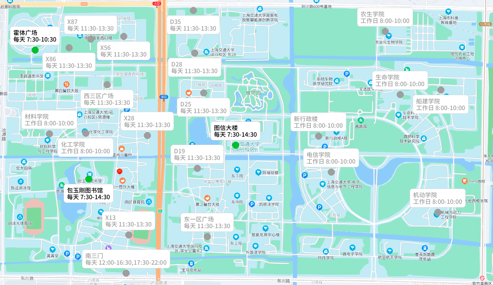

## 1. 插件简介

| 插件名称 | 父类 | 触发关键词 | 触发权限| 内容 |
| ---- | ---- | ---- | ---- | ---- |
| SjtuHesuan | StandardPlugin | '-hs' | None | 发送当前时刻交大核酸点位图 |

## 2. 原理讲解

用长为3的向量来表示二维坐标：

$$
(x, y, 1)^{\rm T} \iff \left(\frac xn, \frac yn, n\right)^{\rm T} \overset{denote}{\implies} (x, y)
$$

平移 $(\Delta x, \Delta y)$ 变换：

$$
\begin{bmatrix}
1&0&\Delta x\\
0&1&\Delta y\\
0&0&1
\end{bmatrix}
$$

绕 $z$ 旋转 $\theta$ 角变换：

$$
\begin{bmatrix}
\cos\theta&\sin\theta&0\\
-\sin\theta&\cos\theta&0\\
0&0&1
\end{bmatrix}
$$

拉伸 $(\lambda, \mu)$ 变换：

$$
\begin{bmatrix}
\lambda&0&0\\
0&\mu&0\\
0&0&1
\end{bmatrix}
$$

地图变换可以视为如下方程，他把经纬度转换为照片材质的uv坐标：

$$
f({\rm lng}, {\rm lat})\implies(u,v)
$$

地图变换把经纬度等比例拉伸到照片上，显然是线性变换，可以视为上面变换的线性组合，那么变换矩阵一定具有如下形式：

$$
\begin{bmatrix}
a_{11}&a_{12}&a_{13}\\
a_{21}&a_{22}&a_{23}\\
0&0&1
\end{bmatrix}
$$

要解出这六个系数，只需要在照片和地图上挑3对不共线的 “经纬-uv” 对应点：

$$
\begin{bmatrix}
a_{11}&a_{12}&a_{13}\\
a_{21}&a_{22}&a_{23}\\
0&0&1
\end{bmatrix}
\begin{bmatrix}
{\rm lng}_1&{\rm lng}_2&{\rm lng}_3\\
{\rm lat}_1&{\rm lat}_2&{\rm lat}_3\\
1&1&1
\end{bmatrix}
=
\begin{bmatrix}
u_1&u_2&u_3\\
v_1&v_2&v_3\\
1&1&1
\end{bmatrix}
$$

解得：

$$
\begin{bmatrix}
a_{11}&a_{12}&a_{13}\\
a_{21}&a_{22}&a_{23}\\
0&0&1
\end{bmatrix}
=
\begin{bmatrix}
u_1&u_2&u_3\\
v_1&v_2&v_3\\
1&1&1
\end{bmatrix}
\begin{bmatrix}
{\rm lng}_1&{\rm lng}_2&{\rm lng}_3\\
{\rm lat}_1&{\rm lat}_2&{\rm lat}_3\\
1&1&1
\end{bmatrix}^{-1}
$$

所以，变换方程可以写成：

$$
\begin{bmatrix}
u\\v\\1
\end{bmatrix}
=
\begin{bmatrix}
u_1&u_2&u_3\\
v_1&v_2&v_3\\
1&1&1
\end{bmatrix}
\begin{bmatrix}
{\rm lng}_1&{\rm lng}_2&{\rm lng}_3\\
{\rm lat}_1&{\rm lat}_2&{\rm lat}_3\\
1&1&1
\end{bmatrix}^{-1}
\begin{bmatrix}
{\rm lng}\\{\rm lat}\\1
\end{bmatrix}
$$

!!! tip "提示：更进一步了解"
    你可以搜索“图形学坐标变换”以更进一步学习背后的知识

## 3. 示范样例

```bash
111> -hs
bot> 【交大核酸点位图片】
```



## 4. 代码分析

代码位于 plugins/sjtuHesuan.py

```python
class SjtuHesuan(StandardPlugin):
    @staticmethod
    def xyToUv(lng:float, lat:float)->Tuple[int, int]:
        loc = np.matrix([[lng], [lat], [1.0]], dtype = np.float64)
        convert = np.matrix([
            [19.0, 1458.0, 10.0],
            [13.0, 27.0, 834.0],
            [1.0, 1.0, 1.0]
        ], dtype = np.float64) * np.matrix([
            [121.429318, 121.4524, 121.434272],
            [31.033855, 31.041409, 31.022526],
            [1.0, 1.0, 1.0]
        ], dtype = np.float64).I
        uv = convert * loc
        return int(uv[0, 0]), int(uv[1, 0])
    @staticmethod
    def getLocColor(openTime: str, daily: bool):
        """获取核酸点位渲染颜色
        @openTime: like '8:00-10:00'
        @return:   圈的颜色, 字的颜色
        """
        def parseTime(timeStr, nowTime: datetime):
            timeParser = re.compile(r'^(\d+):(\d+)-(\d+):(\d+)$')
            t00, t01, t10, t11 = timeParser.findall(timeStr)[0]
            return datetime.combine(nowTime.date(), time(int(t00), int(t01))), \
                   datetime.combine(nowTime.date(), time(int(t10), int(t11)))
        nowTime = datetime.now()
        if not daily and nowTime.isoweekday() >= 6:
            return PALETTE_GREY, PALETTE_GREY
        else:
            for openTime in openTime.split(','):
                startTime, endTime = parseTime(openTime, nowTime)
                warningTime = endTime - timedelta(minutes=20)
                if startTime <= nowTime and nowTime < warningTime:
                    return PALETTE_GREEN, PALETTE_BLACK
                elif warningTime <= nowTime and nowTime < endTime:
                    return PALETTE_ORANGE, PALETTE_BLACK
            return PALETTE_GREY, PALETTE_GREY
            
    def __init__(self) -> None:
        self.hesuanList = json.load(open('resources/sjtuHesuan.json', 'r'))
    def judgeTrigger(self, msg: str, data: Any) -> bool:
        return msg == '-hs'
    def executeEvent(self, msg: str, data: Any) -> Union[None, str]:
        target = data['group_id'] if data['message_type']=='group' else data['user_id']
        hesuanMap = Image.open('resources/images/hesuanMap.png')
        draw = ImageDraw.Draw(hesuanMap)
        for loc in self.hesuanList:
            lng = loc['point']['lng']
            lat = loc['point']['lat']
            x, y = SjtuHesuan.xyToUv(lng, lat)
            r = 10
            circleFill, wordFill = SjtuHesuan.getLocColor(loc['time'], loc['timeTitle'] == '每天')
            draw.ellipse((x-r, y-r, x+r, y+r), fill=circleFill)
            showText = loc['title']+'\n'+loc['timeTitle']+' '+loc['time']
            titlesize = draw.textsize(showText, FONT_SYHT_M18)
            tmp = ResponseImage()
            if loc['title'] in ['X86', '西三区广场', '化工学院', '包玉刚图书馆', '船建学院', 'X56', 'D28', 'D35', 'D25']:
                tmp.drawRoundedRectangle(x-titlesize[0]/2-10, y+15, x+titlesize[0]/2+10, y+35+titlesize[1], fill = PALETTE_WHITE, border = True, target = hesuanMap)
                draw.text((x-titlesize[0]/2, y+25), showText, wordFill , FONT_SYHT_M18)
            else:
                tmp.drawRoundedRectangle(x-titlesize[0]/2-10, y-35-titlesize[1], x+titlesize[0]/2+10, y-15, fill = PALETTE_WHITE, border = True, target = hesuanMap)
                draw.text((x-titlesize[0]/2, y-25-titlesize[1]), showText, wordFill , FONT_SYHT_M18)
        savePath = os.path.join(ROOT_PATH, SAVE_TMP_PATH, 'hesuan-%d.png'%target)
        hesuanMap.save(savePath)
        send(target, f'[CQ:image,file=files://{savePath},id=40000]', data['message_type'])

    def getPluginInfo(self, )->Any:
        return {
            'name': 'SjtuHesuan',
            'description': '核酸查询',
            'commandDescription': '-hs',
            'usePlace': ['group', 'private', ],
            'showInHelp': True,
            'pluginConfigTableNames': [],
            'version': '1.0.3',
            'author': 'Unicorn',
        }
```
